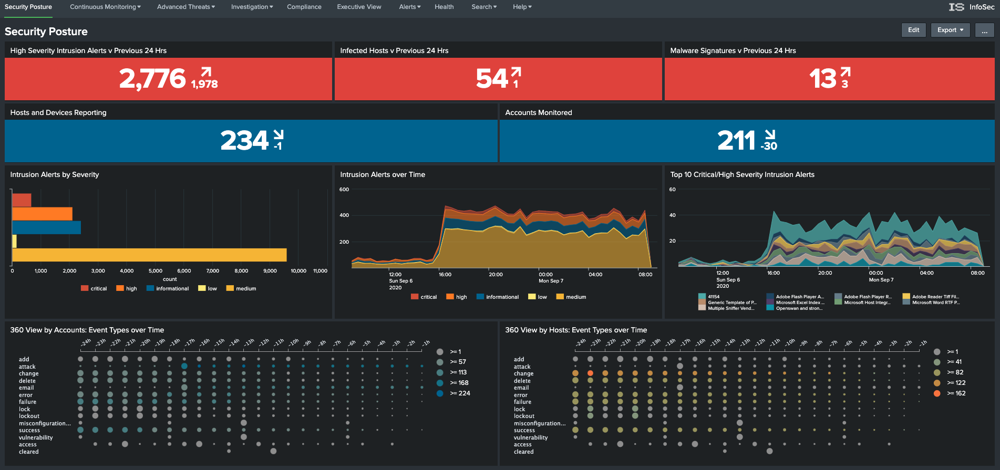

##Introduction to the InfoSec app

The InfoSec app provides the user with a number of pre-configured and customisable security focussed dashboards and alerts. The InfoSec app focuses on the most common security focused technology components within your typical corporate environment, being:

* Firewall (including next-generation firewalls)
* Authentication (e.g. Active Directory and/or LDAP)
* Antivirus (including next-generation antivirus)

Focussing on these three security domains, the InfoSec app provides a comprehensive series of dashboards to help protect your network, users and intellectual property from external adversaries and malicious insider threats. It will help you investigate incidents and automate compliance tasks.

The InfoSec app also provides executive level reporting metrics, trends and summaries. The app can assist with meeting compliance requirements and completing audits faster through the use of customisable reports mapped to common compliance frameworks such as NIST HIPPA PCI and ISO.

A short introductory video is available [here](https://youtu.be/8Qx56cl24dw).

##Training

If you are new to Splunk or need to brush up on your Splunk skills, there are a number of free resources available to help you with your learning journey:

* Splunk [Fundamentals 1](https://www.splunk.com/en_us/training/free-courses/splunk-fundamentals-1.html)

  This is a free Splunk training cource. It will teach you how to search and navigate in Splunk, use fields, get statistics, create reports, dashboards, lookups, alerts, and more. Scenario-based examples and hands-on challenges will enable you to create robust searches, reports, and charts. It will also introduce you to Splunk's datasets features and Pivot interface. It is important to note that once registered, you have 28 days to complete this training. There is a cost associated with signing up for the course a second time.
  
* Splunk [Infrastructure Overview eLearning](https://www.splunk.com/en_us/training/free-courses/splunk-infastructure-overview.html)

  This self-paced course gives users an overview of the Splunk Enterprise infrastructure. Users get a high-level look at how to grow a Splunk deployment from a single instance to a distributed environment. With tips and best practices for deploying, extending and integrating Splunk while showing the user what is happening behind the scenes.
  
Splunk also provides formal training covering a number of learning paths. Information can be found on Splunk's [training website](https://www.splunk.com/en_us/training.html).

Splunk provides a [Quick Reference Guide](https://www.splunk.com/pdfs/solution-guides/splunk-quick-reference-guide.pdf) in PDF format that covers Splunk concepts and commands.

There's also a bunch of [how-to and other videos](https://www.splunk.com/en_us/resources/videos.html) available on the Splunk website to entertain and help you.

Splunk also maintains a [Youtube channel](https://www.youtube.com/user/splunkvideos) that you may want to subscribe to.