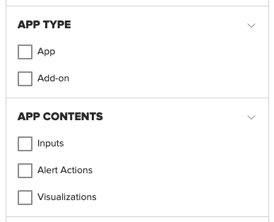
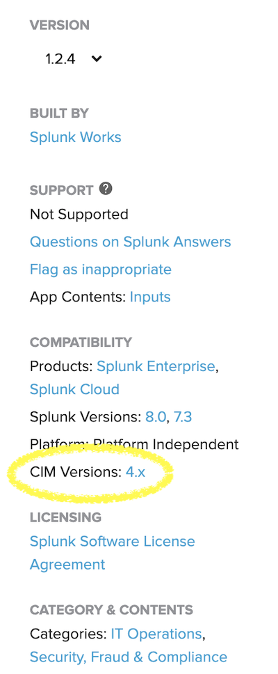
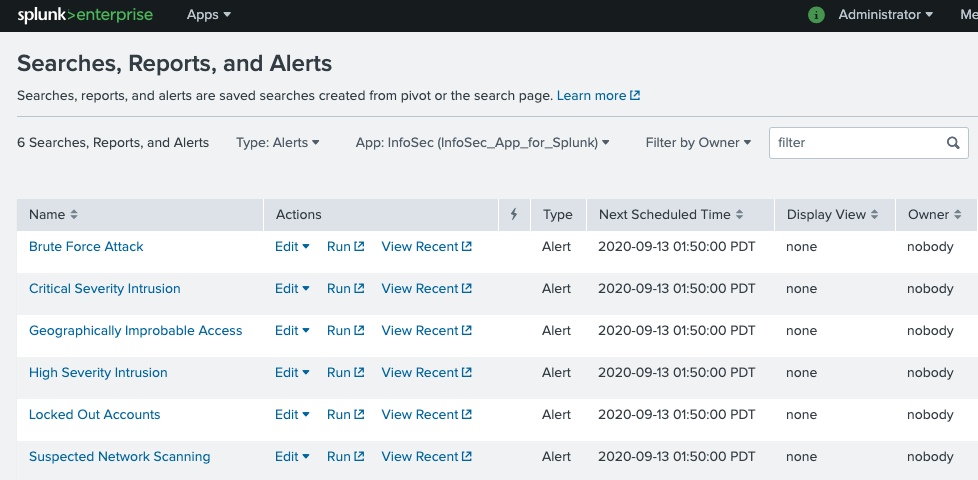

##Concepts and Definitions

The InfoSec app relies on accelerated data models and the Common Information model (CIM) to provide a consistent and normalised view into the event data that you'll bring into Splunk. Understanding how to configure and use the CIM and data models may require an understanding of indexes, source types, sources, fields, event types, tags, macros and a few other concepts, depending on the data sources that you're feeding into Splunk.

Splunk provides a [Splexicon](https://docs.splunk.com/Splexicon), which is a glossary of technical terminology that is specific to Splunk software. Definitions within the Splexicon include links to related information in the Splunk documentation. It is a good place to start if you come across a Splunk word or term that you want to understand further.

A high-level overview of some of some of this terminology is provided below to assist with understanding how to configure, manage and troubleshoot the installation and ongoing use of the InfoSec app. If you are familiar with these Splunk concepts, skip to [Configuration](##configuration).

###Forwarder

A Forwarder is Splunk's data collection worker bee. It provides reliable, secure data collection from remote sources and forwards that data into your Splunk environment for indexing and consolidation. The forwarder can scale to tens of thousands of remote systems, collecting terabytes of data, if required. Splunk's Universal Forwarder is available for installation on diverse computing platforms and architectures. There are two forms of forwarder for the Splunk platform.

* Universal forwarder (UF) - A lightweight, dedicated, streamlined forwarder designed to efficiently send data to your Splunk environment. The Universal forwarder does not have a user interface and is typically managed by a [Deployment Server](##deployment-server).

  In most situations, the universal forwarder is the best way to forward data into Splunk.
  
* Heavy Forwarder (HF) - A more capable forwarder platform with the ability to integrate with additional APIs and services. A heavy forwarder is a full Splunk installation, configured to assume the role of just collecting and forwarding data. A heavy forwarder can route data to additional destinations, including non-splunk platforms. It can also parse/filter data within the pipeline and can index data locally, if required.

In most cases, data collection should be performed by the universal forwarder.

See [About forwarding and receiving](http://docs.splunk.com/Documentation/Forwarder/latest/Forwarder/Aboutforwardingandreceiving) in Splunk's documentation for further information.

You will most likely use a forwarder to collect and index data within Splunk to feed the InfoSec app. Understanding how a forwarder collects and forwards data is important in ensuring the data is correctly typed within your Splunk environment.

###Inputs Data Manager (IDM)

The Splunk Inputs Data Manager (IDM) is a Splunk managed Heavy Forwarder that is bundled with your Splunk Cloud subscription. It is provided to you to assist with onboard cloud-native data sources like AWS, Azure, GCP, Salesforce, and others. Using the IDM removes the need to pass these cloud-native API based data sources though a self-provisioned forwarder either on-premises or within a cloud tenancy. The IDM does not support all the inputs that a traditional Heavy Forwarder can. It will not support UDP or TCP inputs such as syslog. Installing Add-ons onto the IDM requires the creation of a support request.

For further information, please see [here](https://docs.splunk.com/Splexicon:IDM).

If you have plans to bring data sources such as Microsoft 365 into Splunk Cloud and the InfoSec app, you will want to use your IDM to collect this data.

###Deployment server

The Splunk Deployment Server is used to manage a fleet of forwarders within your environment. The deployment server acts as a centralised configuration manager, grouping and collectively managing any number of Splunk forwarder instances. Remotely managed forwarders under the control of the deployment server are called deployment clients. These clients poll the deployment server for new configurations and apps (deployment apps), downloading and enabling them as they become available.

Any full installation of Splunk can function as a deployment server although for larger deployments, it is recommended that a separate server perform this task (i.e. not one of your indexers or your search head(s)).

If you are using Splunk Cloud, you will still an on-premises deployment server to manage your forwarder fleet.

Further information can be found [here](https://docs.splunk.com/Splexicon:Deploymentserver).

Spending some time understanding how to configure and manage a deployment server will simplify the management of your deployers and simplify the process of onboarding data for use within the InfoSec and other Splunk apps.

If you are only ever going to onboard a small number of data sources (e.g. just Microsoft 365) then a deployment server might not be warranted.

### HTTP Event Collector (HEC)

The HTTP event collector is a Splunk service that can run on Splunk indexers or heavy forwarders. The http event collector can efficiently receive data over HTTP (or HTTPS) directly from applications or services.

Further information can be found [here](https://dev.splunk.com/enterprise/docs/devtools/httpeventcollector/).

You may need to configure HEC to collect certain data sources for use with the InfoSec app.

### Other Input Methods

There are many input methods available to assist with getting data in. This goes beyond the scope of this document and the InfoSec app. Splunk maintains very detailed documentation to assist with onboarding data. Please look at Splunk's documentation on [Getting Data In](https://docs.splunk.com/Documentation/SplunkCloud/latest/Admin/IntroGDI)

### Apps and Add-ons

Apps and Add-ons extend Splunk's out-of-the-box capabilities and enable a much faster time-to-value than other solutions as you are taking advantage of existing efforts to onboard and visualise data, or interface with third-party systems.

An App is a collection Splunk configurations designed to address a use-case with Splunk. The [InfoSec App for Splunk](https://splunkbase.splunk.com/app/4240/) is an example of a Splunk app. An app may contain combinations of dashboards, reports, alerts, knowledge objects, lookups, scripted inputs, menus and other components. Together, these components form a functioning application within the Splunk platform. In the same way that roles are given permissions to access and use knowledge objects, Splunk users can only access the apps (and the included knowledge objects) that they have been given permission to use. You can create your own apps in Splunk or download and install apps from [Splunkbase](https://splunkbase.splunk.com).

When browsing Splunkbase, you may notice that there are two types of apps and that the app contents can include Inputs, Alert Actions and Visualisations.

   

All these are considered to be Splunk apps. An Add-on is just an app designed to provide additional capabilities to the Splunk platform, such as getting data in, or providing saved searches or macros. A Splunk app is a packaged-up directory of Splunk configuration files and any required supporting objects. The configurations might include dashboards and alerts, they may include javascript or something else that enables an additional visualisation type within Splunk, or code that enables communications with an external alerting framework or third-party application. Regardless of the content of the app, installation and configuration of the app in Splunk is usually handled in the same way.

####Installing Apps and Add-ons

Not all Apps and Add-ons are supported by Splunk. Most have been created by Splunk's partners and customers and the level of documentation and support will often vary. All apps and Add-ons will have some level of community support through [Splunk Answers](https://answers.splunk.com). The App or Add-on overview page on Splunkbase will show if the app is CIM compliant.

 
 
 The overview page will also indicate where to go to get help and where to find support, if available.

**Splunk supported Add-ons**

Apps and Add-ons built by Splunk are usually Splunk supported. Documentation for Splunk supported Apps and Add-ons is usually contained within Splunk's documentation website. See the [documentation](https://docs.splunk.com/Documentation/AddOns) for the Splunk supported apps and add-ons.

###Knowledge Objects

A knowledge object is a user-defined entity that enriches the existing event data within Splunk. Knowledge objects include saved searches, event types, tags, field extractions, lookups, reports, alerts, data models and workflow actions. The term knowledge object refers to these objects within Splunk's language and documentation. Further information can be found [here](https://docs.splunk.com/Splexicon:Knowledgeobject).

Splunk's documentation will also refer to a knowledge manager, who is someone with administrative, or power user, privileges who can share and manage the permissions of knowledge objects. 
 
###Common Information Model (CIM)

The Splunk Common Information Model (CIM) is a shared semantic model focused on extracting value from data. The CIM is implemented as an add-on that contains a collection of data models (we'll get to what that means soon), documentation, and tools that support the consistent, normalised treatment of data for maximum efficiency at search time.

The InfoSec app relies on the CIM to function properly. If you have not yet installed the CIM to support the InfoSec app. Please look at the [Installation Instructions](#Installation).

Splunk Education has published a short video explaining the value and use of the CIM on YouTube [here](https://www.youtube.com/watch?v=QTklD7OiN74) (8:30 mins). The video also covers installation and configuration of the CIM.

The CIM add-on contains a collection of preconfigured data models that you can apply to your data at search time. Each data model in the CIM consists of a set of field names and tags that define the least common denominator of a domain of interest. You can use these data models to normalise and validate data at search time, accelerate key data in searches and dashboards, or create new reports and visualisations with Pivot.

The add-on also contains several tools that are intended to make analysis, validation, and alerting easier and more consistent. These tools include a custom command for CIM validation and a common action model, which is the common information model for custom alert actions. See [Approaches to using the CIM](https://docs.splunk.com/Documentation/CIM/latest/User/HowtouseCIM) for more information about the tools available in the CIM add-on.

For the InfoSec app to correctly report on the data that you have in Splunk, that data must be present within the supporting data models which means the data must be CIM compliant.

###Index

Splunk stores your data in indexes as events. The default index in Splunk is called "main". Splunk will store your event data in this main index if you don't tell Splunk to put it anywhere else. You can create and specify other indexes for different data inputs. There are several key reasons for having multiple indexes:

* To control user access.
* To accommodate varying retention policies.
* To speed searches in certain situations.

When configuring data models in Splunk, in most cases, you would restrict each data model to just the indexes that contain the data that populates the data model.

Further information on using, creating and managing indexes in Splunk can be found [here](https://docs.splunk.com/Documentation/Splunk/latest/Indexer/Setupmultipleindexes).

###Source type

A source type is used to name or identify each different type of data in Splunk. The definition of a source type will define how the timestamp is interpreted, what defines the break between different events and how Splunk might decipher and understand the structure of events. A source type could be considered the fingerprint or DNA of the event data entering Splunk. When configuring Splunk to receive or index data, you will always define a source type, or a source type may be pre-defined within an Add-on that you've chosen to use to help you onboard data into Splunk. As an example, the source types defined within the Splunk Add-on for Windows are listed within Splunk's documentation [here](https://docs.splunk.com/Documentation/WindowsAddOn/latest/User/SourcetypesandCIMdatamodelinfo).

Some source types may be structured, such as json, XML or CSV whereas others may have no structure.

This [blog post](https://www.splunk.com/en_us/blog/tips-and-tricks/sourcetypes-whats-in-name.html) provides a good introduction to source types with Splunk.

Splunk software ships with a set of built-in source types that are known as [pretrained source types](https://docs.splunk.com/Documentation/Splunk/latest/Data/Listofpretrainedsourcetypes).

###Source

A source in Splunk is not to be confused with source type. Where a source type identifies the structure of events or data within Splunk, the source identifies where that event data has come from. The source is the name of the file, stream or other input from which a particular event has come from. The below is an example of the difference between source and source type

`source=/var/log/messages and sourcetype=linux_syslog`

Every event in Splunk will have a pre-defined index, host, source, source type and _time field. For more information, see [default fields](https://docs.splunk.com/Splexicon:Defaultfield).

###Host

Within Splunk, all event data will be assigned to a host. The host identifies the network device that collected the data for Splunk. It may be a hostname or IP address. Further information can be found in the [Splunk documentation](https://docs.splunk.com/Documentation/Splunk/8.0.5/Data/Abouthosts). The host field is considered a [default fields](https://docs.splunk.com/Splexicon:Defaultfield).

###Field

Fields appear in event data as searchable name-value pairings such as `user_name=fred`. Fields are the building blocks of Splunk searches, reports and data models.

Splunk will attempt to auto-extract values into fields from within the event data that is being indexed. This is normally performed at search time.

Fields will often be defined within event data as key value pairs such as `user=fred` or `src:192.168.10.5` or may simply be a number or text within the structure of the event with no defined key. Splunk can still identify these fields using a custom [field extraction](https://docs.splunk.com/Splexicon:Fieldextraction) through Splunk web. A field extraction is defined against a source type, a source or a host.

Further information on fields in Splunk can be found [here](https://docs.splunk.com/Documentation/Splunk/latest/Knowledge/Aboutfields).

The values from fields within event data are used populate enabled data models within Splunk. 

Often, fields defined as key value pairs within event data may not align with the naming standard defined within the CIM and data models. In order to work with this event data, the names of these fields needs to be changed to conform with the CIM naming standard. This can be done using Aliases.

###Alias

An alias (or field alias) in Splunk is an alternate name assigned to a field that has been extracted from the event data within a Splunk index. Field aliases for fields can be defined against a source type, a source or a host. They can be defined within Splunk web by going into the Settings -> Fields menu. If you are working with a data source that is not yet CIM compliant, you may need to create field aliases to map existing fields within your data source to the [CIM naming convention](https://docs.splunk.com/Documentation/CIM/latest/User/CIMfields).

See Splunk's [documentation on Fields](https://docs.splunk.com/Documentation/Splunk/latest/Knowledge/Abouttagsandaliases) for further information.

###Event type

An event type in Splunk is a category of events united by the same search. Event types are useful for categorising a subset of event data from within one source type, or uniting events of a certain type across multiple source types. Event types and tags go hand-in-hand in assisting with preparing data for use in data models.

This is an older Splunk [video](https://www.youtube.com/watch?v=KhdMgT9VbHs) that covers the subject of event types.

See Splunk's [documentation on event types](https://docs.splunk.com/Documentation/Splunk/latest/Knowledge/Abouteventtypes) for further information.

###Tags

Tags enable you to assign names to specific field and value combinations. This includes event type, host, source and source type field value combinations. Tags tend to work hand-in-hand with event types.
An example of the use of tags might be to create an `authentication` tag that matches:

	eventtype=windows_successful_login
	eventtype=windows_failed_login
	eventtype=vpn_successful_login
	eventtype=vpn_failed_login
	
A search within Splunk for `tag = authentication` will return all events that match any of the above event types.

See Splunk's [documentation on tags](https://docs.splunk.com/Documentation/Splunk/latest/Knowledge/Abouttagsandaliases) for further information.

###Permissions, users and roles

Permissions within Splunk define who has access to data and knowledge objects. Roles within Splunk are given permission to access data within indexes and access apps and knowledge objects. Splunk users inherit the permissions granted to the roles that have been assigned to the user.

When first created within Splunk web, knowledge objects are private and only accessible to the user that created them. A Splunk knowledge manager can share these objects with other Splunk users by adjusting the permissions of the objects. Knowledge objects can be shared with individual roles, or everyone. Knowledge objects can also be restricted to be available within a single app, or globally.

Permissions for knowledge objects can be managed through the Settings menu within Splunk web. It is important to understand that permissions related to knowledge objects can impact data models. Fields and Tags that are private cannot feed a data model. Private data models cannot be accelerated, etc. Wen troubleshooting, checking the permissions on knowledge objects can often identify the cause of an issue.

Further information can be found in Spunk's [documentation](https://docs.splunk.com/Splexicon:Permissions).

###Macros

Search macros contain snippets of searches for re-use in other Splunk searches. A search macro is referenced in other searches through its name. You enclose the name of a search macro within the back-tick character to reference it in another search. As an example, you could create a search macro named `iis_logs` with the following definition:

    (index=windows OR index=dmz sourcetype=iis)

When searching for events within Splunk, you can reference the macro within your search

    `iis_logs` cs_username="fred"
    
Splunk will expand the macro when performing the search resulting the following search being run

    (index=windows OR index=dmz sourcetype=iis) cs_username="fred"

data models make use of search macros to define what data should be included within the data model.

Further information can be found in Splunk's [documentation](https://docs.splunk.com/Splexicon:Searchmacro).

###Data models and acceleration

A data model is a form of knowledge object that applies structure to the event data within Splunk. each data model within Splunk represents a category of event data (e.g. authentication data). Data models are powered by root searches that define what data is represented and available within the data model. The data model overlays a schema onto the event data identified by the base search and presents the data to the user as columns of fields over rows of data. Splunk's pivot and datasets interface can be used to query data models to build visualisations and reports.

The schema that is applied to the event data in the form of a data model can be accelerated in Splunk. This is called an accelerated data model. Accelerated data models power apps such as Enterprise Security and the InfoSec app. A data model that has been accelerated cannot be edited. If you need to edit an accelerated data model, you must disable acceleration.

Splunk accelerates data models by running regular scheduled searches (every 5 minutes) across the underlying event data, building data summaries behind the scene with the help of Splunk's high performance analytics store functionality.

Data models can only be accelerated if they are shared and not private.

Further information can be found in Splunk's [documentation](https://docs.splunk.com/.Splexicon:Datamodel).

###Configuration Files

All configuration settings within Splunk are stored within configuration files that can be manually edited. Interacting and managing Splunk through the Splunk web interface simplifies the management of the underlying configuration files. If you are using Splunk Cloud, you actually don't have access to the underlying configurations files within Splunk and must perform all management tasks through Splunk web.

Whether you are using Splunk Cloud or Splunk Enterprise, there will still be times where you will need to modify a configuration file to perform some task within Splunk. Modifying configuration files is most often associated with [getting data in](https://docs.splunk.com/Documentation/SplunkCloud/8.0.2007/Admin/IntroGDI).

Splunk configuration files are stored within the `etc` directory within the Splunk installation directory. Under Linux, this defaults to `/opt/splunk`. Under Windows, this defaults to `C:\Program Files\Splunk`. Modifying configuration files within the Splunk directory often requires the Splunk service to be restarted so that Splunk adopts the changes that you have made.

Splunk configuration files are disbursed within the `etc` directory structure. Configuration files could be private to the user, or located within an installed or deployed app. 

Splunk applies an [order of precedence](https://docs.splunk.com/Documentation/Splunk/latest/Admin/Wheretofindtheconfigurationfiles) to configuration files to allow `default` configurations to be overridden by `local` configurations. It is Splunk best-practice to never modify a `default` configuration. A Splunk administrator should always copy the settings into a `local` copy of the configuration file.

Further information can be found [here](https://docs.splunk.com/Splexicon:Configurationfile#:~:text=A%20file%20(also%20referred%20to,SPLUNK_HOME%2Fetc%2Fsystem%2Fdefault).

###The data pipeline

The Splunk data pipeline describes the route that data takes moving from its original source to its transformation into searchable events that encapsulate valuable knowledge. The data pipeline includes these segments:

* [Input](https://docs.splunk.com/Splexicon:Input)
* [Parsing](https://docs.splunk.com/Splexicon:Parsing)
* [Indexing](https://docs.splunk.com/Splexicon:Index)
* [Search](https://docs.splunk.com/Splexicon:Search)

###Alerts

Alerts in Splunk are used to monitor and respond to specific events that are detected by a saved search that is run at a scheduled time. An alert will initiate one or more alert actions when the alert triggers.

The InfoSec app utilises alerts to detect and report on notable events within your data. Understanding how to add, configure and manage alerts is an important skill when it comes to adding additional controls and use-cases to your environment.

Further information on working with Alerts can be found in Splunk's [documentation](https://docs.splunk.com/Documentation/Splunk/latest/Alert/Aboutalerts).
