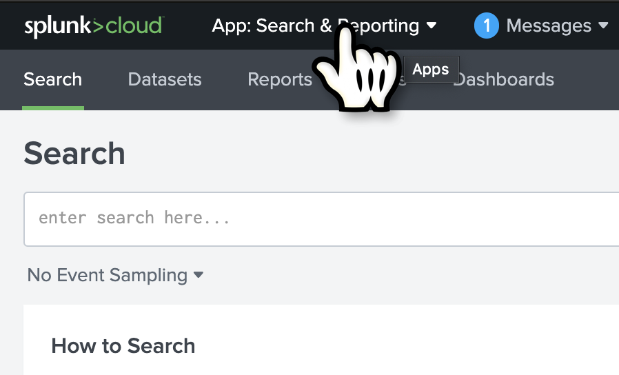
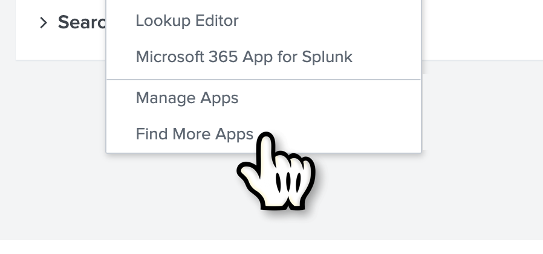
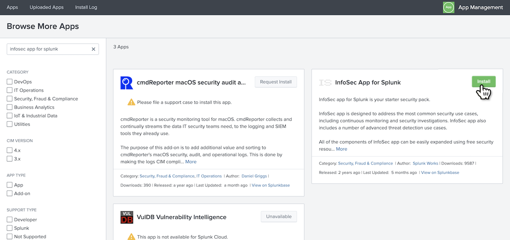
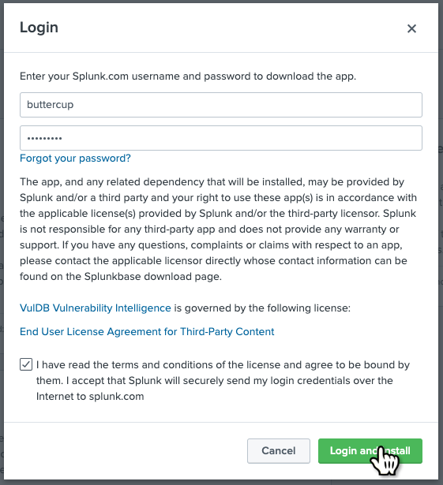
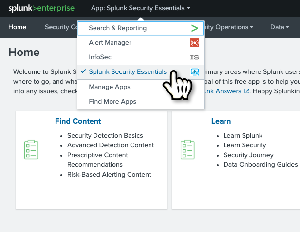
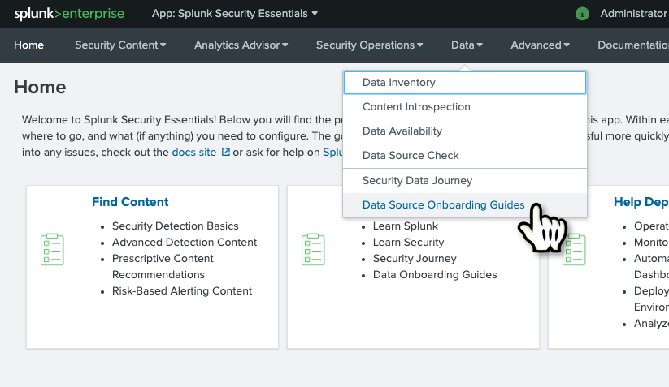
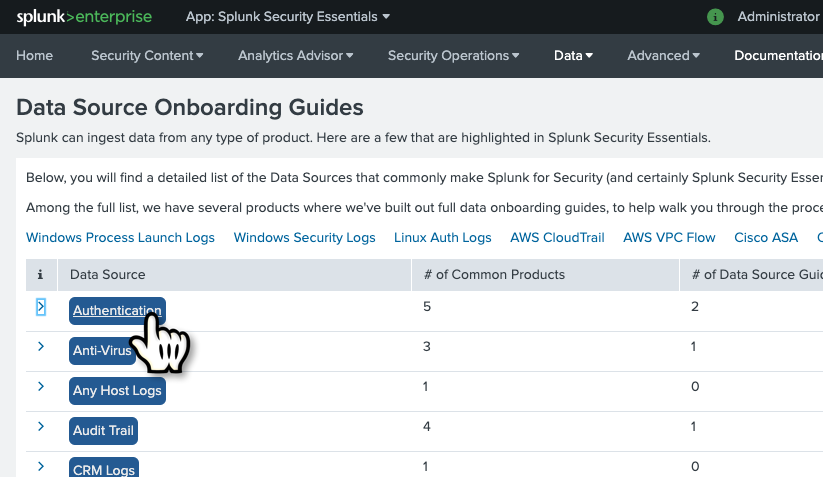
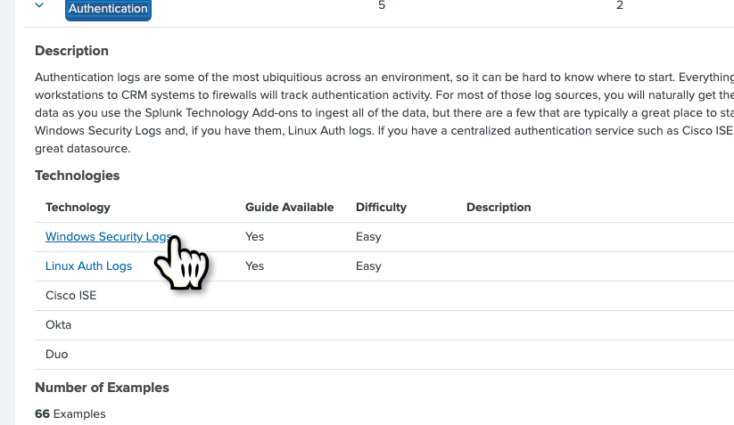
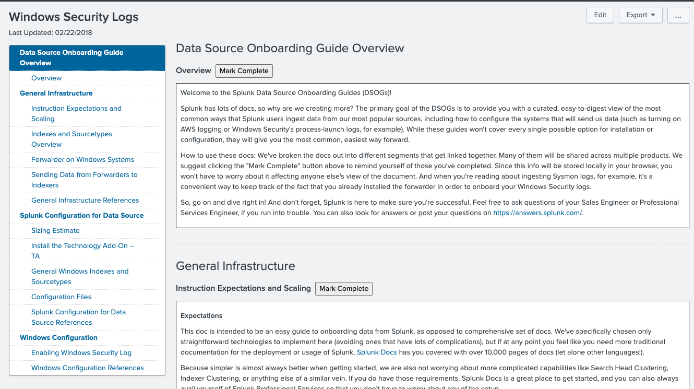

## Installation

The InfoSec app for Splunk can be installed directly into Splunk in the same way as other available apps from [Splunkbase](https://splunkbase.splunk.com/). Installing the app and pre-requisites should take less than 15 minutes.

###Installation Prerequisites

It's assumed that you already have Splunk installed somewhere, or you're using Splunk Cloud. This document does not cover installing and configuring Splunk for the first time. If you need to do this before proceeding further, please view the following resources:

* [Installing Splunk on Linux documentation](https://docs.splunk.com/Documentation/Splunk/latest/Installation/InstallonLinux). There's also a video [here](https://www.splunk.com/en_us/training/videos/installing-splunk-enterprise-on-linux.html).

* [Installing Splunk on Windows documentation](https://docs.splunk.com/Documentation/Splunk/latest/Installation/InstallonWindows). There's also a video [here](https://www.splunk.com/en_us/resources/videos/installing-splunk-on-windows.html).

* [Start Splunk Enterprise for the first time](https://docs.splunk.com/Documentation/Splunk/latest/Installation/StartSplunkforthefirsttime)

* [Installing the Splunk Enterprise License](https://docs.splunk.com/Documentation/Splunk/latest/Installation/Installalicense)

* [A short introductory video to using the Splunk web interface](https://www.splunk.com/en_us/resources/videos/splunk-web-demo.html)

###Installation Steps

The method for installing the InfoSec app will vary slightly between Splunk Enterprise and Splunk Cloud. If there is a difference within the steps. Each will be explained.

1. Log into your Splunk environment with an account that has administrative privileges.

	If you are a Splunk Cloud customer and are new to using Splunk Cloud. Splunk will have supplied you with two instances:
	
    * `https://<stackname>.splunkcloud.com` - This instance is your primary Splunk environment and is where you should install the InfoSec app. Log into this instance to perform the installation.
        
    * `https://idm-<stackname>.splunkcloud.com` - This is an 'Inputs Data Manager (IDM)'. It is a heavy forwarder that Splunk provides to assist with the collection of event data from cloud-based services like AWS, Azure, etc. If you're going to bring in Microsoft365, AWS or other cloud service data sources into your Splunk environment, you'll need to install technology Add-ons onto the IDM through a support request. The InfoSec app should not be installed onto the IDM.	

2. From within the Splunk web interface, select the App menu within the black menu bar at the top left of the user interface (just to the right of the Splunk logo). 

   
   

3. Select Find More Apps

     

4. Within the search menu on the top-left of the page, search for `infosec app for splunk`. The InfoSec App for Splunk should be listed as one of the available apps for installation.

   
   
   **Splunk Cloud**

   Within Splunk Cloud, the InfoSec app cannot be self-installed and requires a support request to be raised through Splunk's [Support Portal](https://splunkcommunities.force.com). Request that the app is installed on the Search Head. 
   
   One of the supporting apps (The Common Information Model CIM app) also needs to be installed through a support request. Log the installation of this app within the same request.

   **Splunk Enterprise**
   
   5. Press the green `Install` button for the InfoSec App for Splunk. The process will be slightly different between Splunk Cloud and Splunk Enterprise.

   Within the presented dialog box, login with your splunk.com credentials to install the app. The required credentials are what you would use to login to the support portal on the splunk.com website or Splunkbase and is not your Splunk Enterprise instance account login (e.g. administrator, or whatever you have created or been assigned). If you have not yet setup a splunk.com account, you can do so [here](https://www.splunk.com/page/sign_up).
   
   You will also need to accept the Terms and Conditions by checking the box before being able to proceed.
      
   
   
   Note: The ability to install Apps and Add-ons directly into your Splunk environment requires internet connectivity. Your Splunk environment must be able to access https://splunkbase.splunk.com over port TCP/443. If searching for additional apps like the InfoSec app is not producing any results, you may have a problem with Internet connectivity. If the only method of gaining access is through a proxy server, then this must be configured. Instructions on how to configure Splunk to use your HTTP Proxy Server can be found [here](https://docs.splunk.com/Documentation/Splunk/latest/Admin/ConfigureSplunkforproxy).
    
   If configuring Internet access for your Splunk environment is not possible, you can still install apps manually via a two-step process. You will first need to download the apps from [Splunkbase](https://splunkbase.splunk.com) to your desktop. Next, you will need to install the apps into your Splunk environment via "[Install app from file](https://community.splunk.com/t5/Archive/How-to-install-a-splunk-app/m-p/87912)". This app installation method is not applicable for Splunk Cloud.

   If you have a larger distributed Splunk Enterprise environment, you only need to install the InfoSec app on the search head. It does not need to be installed on the indexers. If your Splunk environment also includes search head clusters, you'll need to use the `Deployer` to push the app out to all the cluster peers. See the documentation [here](https://docs.splunk.com/Documentation/Splunk/latest/DistSearch/PropagateSHCconfigurationchanges). 
   
The InfoSec app for Splunk should now be installed. To confirm this, select the InfoSec app from the App menu (see step 2, above). You should be presented with the `Security Posture` dashboard. At this point, you can ignore any errors you might see on the InfoSec dashboard as there are still a couple of steps needed to complete the installation and configuration.

###Additional Apps and Add-ons

A number of supporting Splunk Apps and Add-ons from Splunkbase must also be installed before you can start using the InfoSec app. These are:

* [Splunk Common Information Model (CIM)](https://splunkbase.splunk.com/app/1621/)
* [Punchcard visualisation](https://splunkbase.splunk.com/app/3129/)
* [Force Directed visualisation](https://splunkbase.splunk.com/app/3767/)
* [Lookup File Editor](https://splunkbase.splunk.com/app/1724/) (new requirement starting from InfoSec v1.5)
* [Sankey Diagram visualisation](https://splunkbase.splunk.com/app/3112/) (new optional prerequisite for the experimental VPN Access dashboard starting from v1.5.3)

Although not essential, the following three Apps and Add-ons should also be installed.

* [Splunk Security Essentials](https://splunkbase.splunk.com/app/3593/)

  The Splunk Security Essentials App includes hundreds of additional security searches that can be integrated into the InfoSec App. The Splunk Security Essentials App also includes comprehensive guided data onboarding examples that can help identify the right data sources to enable the security controls and assisting with the configuration of the underlying data source.
  
* [Alert Manager Add-on](https://splunkbase.splunk.com/app/3365/)
* [Alert Manager App](https://splunkbase.splunk.com/app/2665/)

  The third-party Alert Manager app and add-on provides an incident management capability with simple workflows to support the management of triggered alerts from within the InfoSec app. Installation and configuration instructions are available [here](http://docs.alertmanager.info/).

   
####Splunk Cloud

With the exception of the Splunk Common Information Model app, all these additional apps can be self-installed within Splunk Cloud. Search for these apps in the same way that you searched for the InfoSec app, following the instructions above. Select the green `Install` button for each app.

####Splunk Enterprise
   
The process to install these additional Apps and Add-ons is the same as you've just completed when installing the InfoSec app. Repeat the above steps to install each of these additional Apps and Add-ons.

Once you've reached this step, you are ready to start configuring the InfoSec App for Splunk.

## Data Sources   

For the InfoSec app to function correctly, at a minimum, you should have data from the following security sources collected by your Splunk environment:

* Firewall, IDS/IPS data (e.g. Cisco, Palo Alto Networks, Check Point, Fortinet, Juniper)

* Authentication data (e.g. Active Directory data from the Windows logs on Domain Controllers or Microsoft365) With Microsoft Active Directory, the correct audit policy will need to be set to ensure the logging of the right event data.

* Malware/antivirus tools data (e.g. Symantec, McAfee, Sophos, Trend Micro)

All data used by InfoSec app must be Common Information Model (CIM)-compliant. The easiest way to accomplish that is to use CIM-compliant Splunk Add-ons for your security devices.

###Onboarding Data Sources

Correctly onboarding data into Splunk can be daunting at first. Trying to cover every combination of data source for the InfoSec app is beyond the scope of this documentation.

If you installed the Splunk Security Essentials app when following the [Installation steps](#installation), you'll have access to detailed guided onboarding instructions for many security data sources. As an example, to obtain the instructions to onboard Windows Authentication events, f

1. Open the `Splunk Security Essentials` app

  

2. Navigate to the Data `Source Onboarding Guides`

  
  
3. Select Authentication

  
  
4. Select Windows Security Logs

  
  
5. Follow the presented guided procedure

  