##Configuration

After performing the installation steps documented above, start by confirming the Health of the InfoSec app within your environment. 

1. Navigate to the InfoSec app by selecting the `InfoSec` app from the App menu at the top of the Splunk Web interface.

	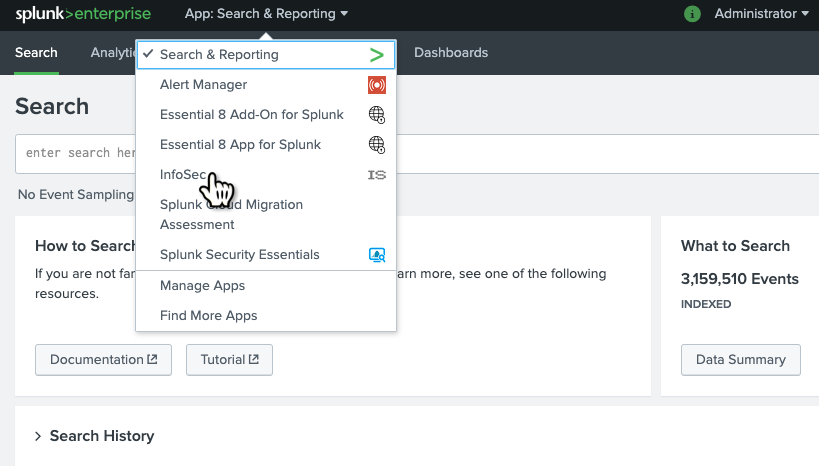
	
2. Select the `Health` dashboard from within the InfoSec app.

	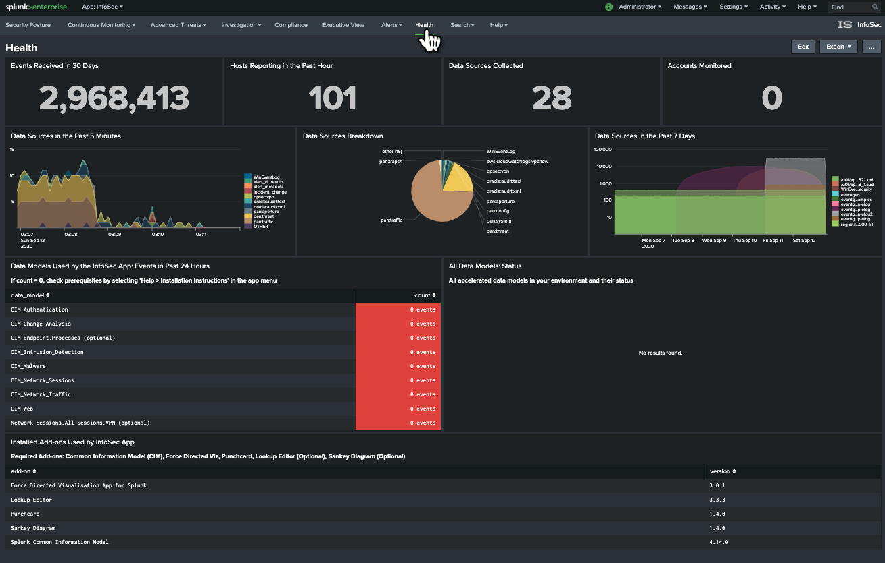

The first two rows of visuals within the Health dashboard will give you an indication of the data within your Splunk environment.

There are three metrics on this dashboard that need to be verified:

1. The count of events feeding each of the data models required for the InfoSec app.

	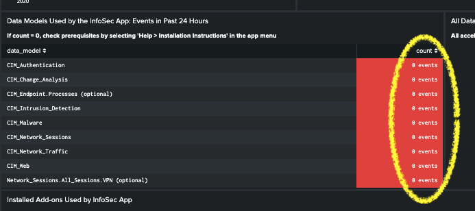
	
	In the above example, there is no data feeding the CIM_Authentication, or any of the other data models. Don't be concerned if some of the data models in your environment have no data. Within your Splunk environment you may not have a data source to feed some of these data models. Follow the steps in [Validating Data Sources](###validating-data-sources) to confirm your environment is correctly configured for each of these data models.

2. The Acceleration Status for each of the required InfoSec data models.

	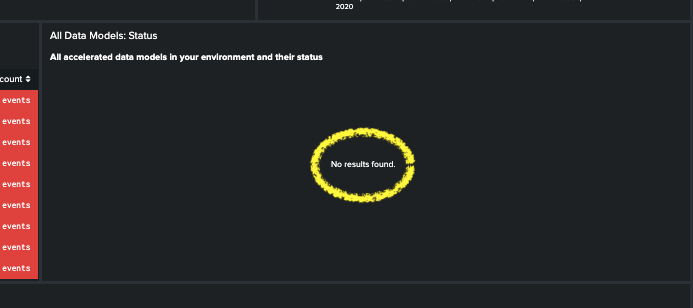
	
	In the above example, the Health dashboard is reporting that there are no accelerated data models. You should only enable acceleration for the data models that are being fed with data. Follow the steps in [Accelerating Data Models](###accelerate-data-models) to confirm your environment is correctly configured.
	
3. The Installation status for each of the required supporting Apps/Add-ons for InfoSec.

	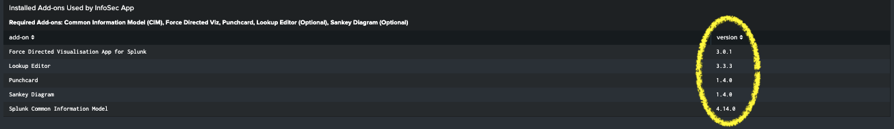
	
	In the above example, the Health dashboard is reporting that all the required Add-ons are installed. If you had correctly followed the Installation Instructions above, your Health dashboard should also be reporting that all Add-ons are installed. If this is not the case, follow the steps in [Additional Apps and Add-on](3 - Installation.md###additional-apps-and-add-ons) to confirm your environment is correctly configured.

###Validating Data Sources

You will need to confirm the data sources for each of the InfoSec data models listed on the Health dashboard. In the example above, the authentication data model is receiving no event data. We'll walk through the steps to validate the configuration of the `Authentication` data model. The same process can be applied to all the data models.

It would pay to validate the data sources for each of the data models, even if the Health dashboard is reporting that data is being fed into the data model. Within your environment, you may find that only some of the data you were expecting within the data model is being fed into it and you may want, or need, to adjust the configuration to ensure full coverage of your environment.

You may also find that your data sources feed more than just one data model.

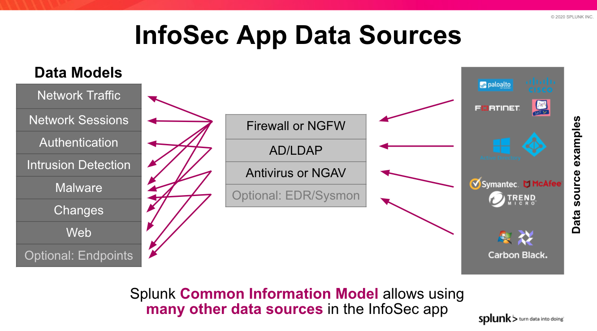

This search can be used to identify the indexes and source types that are feeding each of the InfoSec data models:

    |  makeresults 
    | eval datamodels = "Authentication:Change:Endpoint:Intrusion_Detection:Network_Sessions:Network_Traffic:Malware:Endpoint.Processes:Web"
    | makemv delim=":" datamodels
    |  mvexpand datamodels 
    | map search="| makeresults | eval notfound=\"*** NO DATA FOUND ***\" | append [| tstats count from datamodel=$datamodels$ by index, sourcetype] |  eventstats count as events |eval datamodel=\"$datamodels$\", index=coalesce(index,notfound)| search NOT notfound=* OR events=1 | table datamodel, index, sourcetype,count"
    | sort datamodel, index, sourcetype

If you're happy with the results of this search and can see that each of the required data models is being populated with data, you may want to progress directly to [Accelerate Data Models](#accelerate-data-models). Also note that it's best practice to restrict a data model to only the indexes that need to feed it with data. For this reason, you may still want to work through the next few steps.

To correctly configure each of the InfoSec required data models to find the right tagged events within your environment, repeat the following process on each data model.

1. Select `Data models` from the `Settings` menu.

	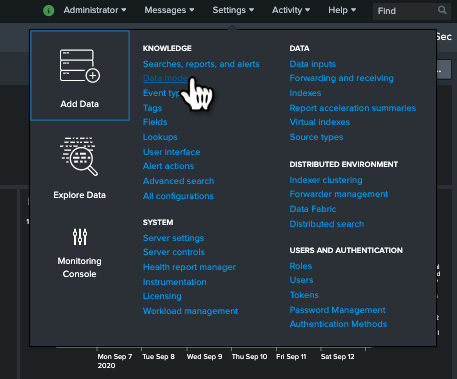

2. Find the `Authentication` data model within the list of presented data models and select it. You can use the filters at the top of the page to assist, if required.

	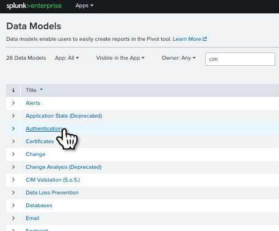
	
3. You will now be presented with the Authentication data model configuration. It should look similar to the screenshot below.

	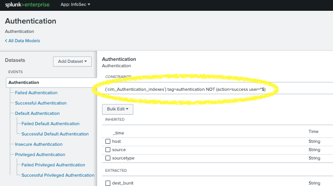 
	
	At the top of the data model configuration page is a section labelled `CONSTRAINTS`. This contains the Splunk search that identifies the events that should feed the Authentication data model. Your search should look something like this:
	
	``(`cim_Authentication_indexes`) tag=authentication NOT (action=success user=*$)``
	
	The first part of the search contains a macro called `cim_Authentication_indexes`. We know it is a macro because it is enclosed within back-ticks. This macro is most likely constraining the search to certain indexes.
	
	The next part of the search (`tag=authentication`) is constraining the search to only return events that have been tagged as authentication events.
	
	The last part of the search (`NOT (action=success user=*$)`) is excluding any event containing a field labelled `action` with a value of `success` AND a field `user` that has a value that ends with the `$` character. We can ignore this last part of the search for the moment as it is reducing (NOT) the returned results
	
	We want to find out which data sources we have in Splunk that might fit this search.
	
4. Open a new Splunk search window in another tab of your browser. The quickest way to do this is to right-click on `Search & Reporting` from the `App` menu at the top of the Splunk web interface and select `Open Link in New Tab`.

	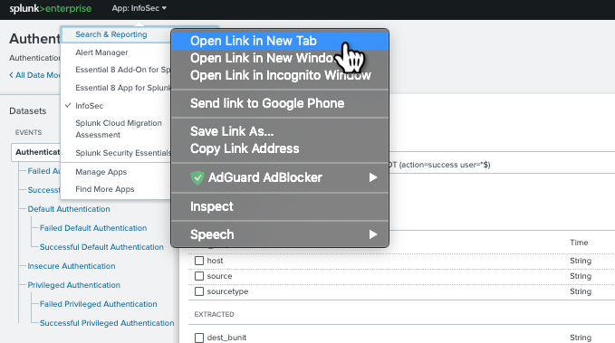

	Before pivoting to the new browser tab, highlight and copy the:
	
	 ``(`cim_Authentication_indexes`) tag=authentication NOT (action=success user=*$)`` 
	 
	 search so that we can paste it into the search tab we've just opened. Execute the search in the new tab. In this example, no results are returned. Within your Splunk environment, you may have some data returned.
	 
	 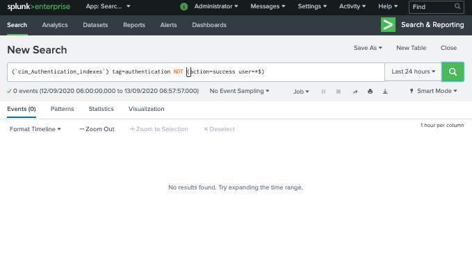
	 
	 We're now going to investigate why no results were returned and identify what we need to do to adjust the configuration.
	 
5. The next step is to modify the search to include ALL indexes within your Splunk environment. Replace the macro component of the search with `index=*` and include a statistical count by index and source type at the end of the search by adding `|stats count by index, sourcetype`. In this example, the search will now look like this:

	 ``index=* tag=authentication NOT (action=success user=*$) | stats count by index, sourcetype``
	 
	 Execute the search to see if any results are returned.
	 
	 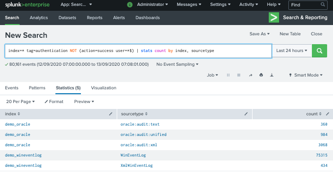
	 
	 In this example, we can see a number of source types returned across two indexes named `demo_oracle` and `demo_wineventlog`. This indicates that we do have correctly tagged events in two indexes within our Splunk environment, but our original search macro, defined as `cim_Authentication_indexes` was not including these indexes within its definition.
	 
	 When you perform this search in your environment you will see different results than this example. If no results were returned, then the data in your environment may not be tagged correctly or may not be CIM compliant. You may need to investigate why by searching the event data. In this example, troubleshooting further would require investigating why `tag=authentication` is not matching any events. This will involve examining the data sources that you believe should contain authentication events.
	 
	 Watch this Splunk Education [video](https://www.youtube.com/watch?v=QTklD7OiN74) on the Splunk Common Information Model. If this doesn't help guide you towards solving the problem, try requesting [help](#support) from the Splunk Community.
	 
	 If your search results returned indexes and data sources, we can proceed with modifying the search macro for this data model.
	 
6. Take note of the name of the indexes returned by the above search as the next step we perform will be to update the macro. In our example, we have two indexes `demo_oracle` and `demo_wineventlog`.

7. Open the `Advanced Search` under the `Settings` menu.

	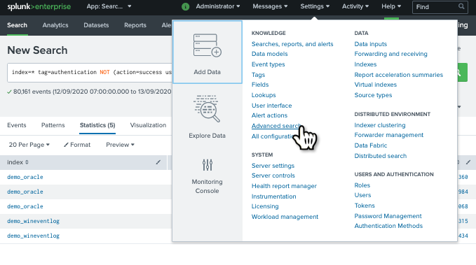
	
8. Open `Search Macros`

	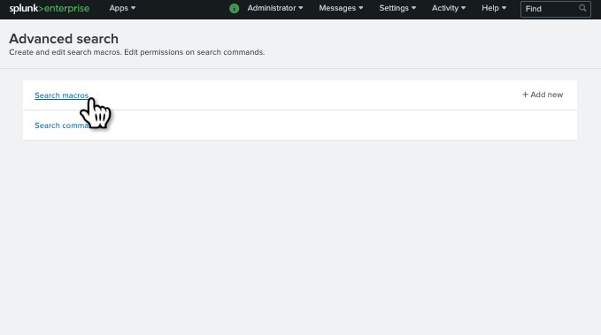
	
9. Search for the `cim_Authentication_indexes` macro. You will probably need to adjust the filter to find the macro. Set the App context to `All` and type in `cim_authentication_indexes` into the search filter.

	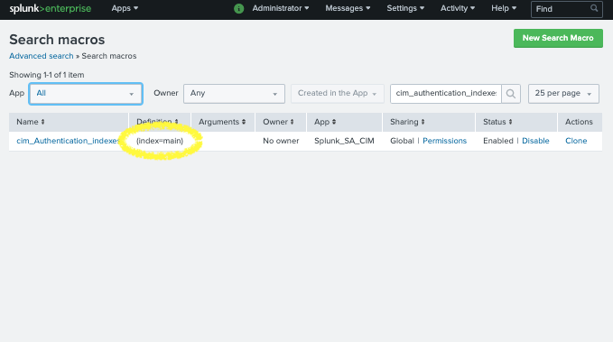
	
	In this example, we can see the definition is set to `(index=main)`. This is the reason why the Authentication data model was not being fed with data as main contained no events constrained by the original search that included `tag=authentication`. 

10. Click on the macro name to open it for editing.

	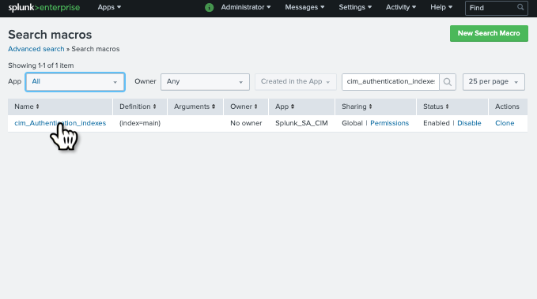
	
	You should be presented with the CIM Setup window for the `Authentication` data model.
	
	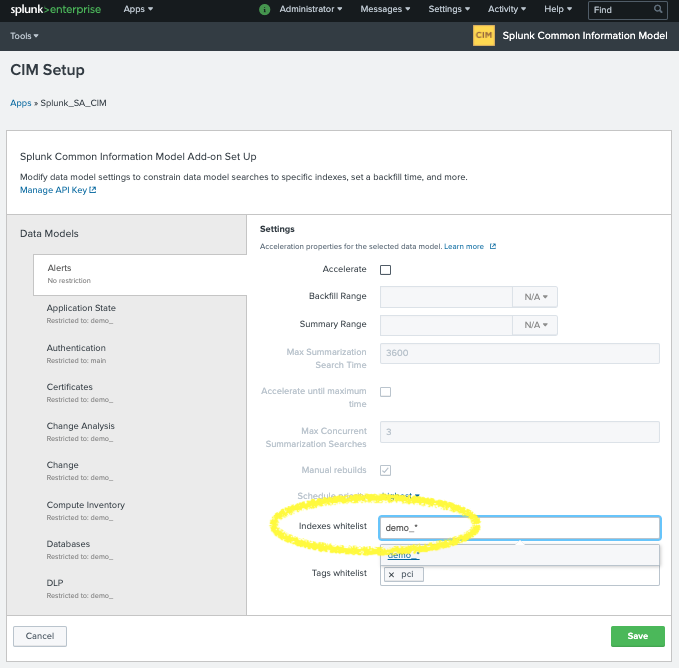
	
	Change the `Indexes whitelist` to include the indexes identified in step 6, above. This terminology may change in a future version to `Indexes Allowlist`.
	
11. Save the change by selecting the Green `Save` button.

12. Verify that the change is successful by re-running the original data model search. In this example, the search was:

	``(`cim_Authentication_indexes`) tag=authentication NOT (action=success user=*$)``
		
	The search should now return events. Your search will be different from the above, depending on the data model you are working with.
	
Repeat this process for all the InfoSec data models:

* Authentication
* Change (for app version 1.6.x and newer) or Change Analysis (for app version 1.5.3 and older)
* Intrusion_Detection
* Malware
* Network_Sessions
* Network_Traffic
* Endpoint
* Web

In order to aid with configuration, the default constraining search and search macro for each of the required data models is listed in the table below. You will notice that for each data model, there is no search macro defined (e.g. `()`). If this is not changed, then the data model is relying on your data residing in indexes searched by default.

| Data model | Base search/CONSTRAINT | Search Macro |
| ---------- | ---------------------- | ------------ |
| Authentication | (\`cim\_Authentication\_indexes\`) tag=authentication NOT (action=success user=*$)` | () |
| Change | (\`cim\_Change\_indexes\`) tag=change NOT (object_category=file OR object_category=directory OR object_category=registry) | () |
| Intrusion Detection | (\`cim\_Intrusion\_Detection\_indexes\`) tag=ids tag=attack | () |
| Malware | (\`cim\_Malware\_indexes\`) tag=malware tag=attack | () |
| Network Sessions | (\`cim\_Network\_Sessions_indexes\`) tag=network tag=session | () |
| Network Traffic | (\`cim\_Network\_Traffic\_indexes\`) tag=network tag=communicate | () |
| Endpoint | (\`cim\_Endpoint\_indexes\`) tag=listening tag=port \| eval transport=if(isnull(transport) OR transport="","unknown",transport),dest\_port=if(isnull(dest\_port) OR dest\_port="",0,dest_port),transport\_dest\_port=mvzip(transport,dest\_port,"/") \| mvexpand transport\_dest\_port | () |
| Web | (\`cim_Web\_indexes\`) tag=web | () |

###Accelerate Data Models

Once you've confirmed that you're getting the right data into the data models, it's time to accelerate them.

Each of the InfoSec data models will need to be accelerated. Only accelerate the data models after you have confirmed that they are being correctly fed with the right event data as once accelerated, the data models cannot be edited without first disabling the acceleration. Perform the following procedure on all the InfoSec data models that are being fed data.

There is no value in accelerating a data model that contains no event data.

In this example, we'll accelerate the `Authentication` data model.

1. Select `Data models` from the `Settings` menu.

	

2. Find the `Authentication` data model within the list of presented data models BUT DON'T CLICK ON IT! We'll be working within the current web page. You can use the filters at the top of the page to assist in finding the model, if required.

	Once you've located the `Authentication` data model within the list, from the `Actions` column, select `Edit -> Edit Acceleration`.

	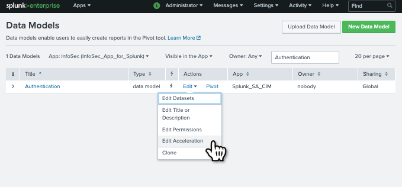

3. Within the `Edit Acceleration` dialog box, check `Accelerate`. Set the Summary Range to a suitable timeframe and `Save`.
	
	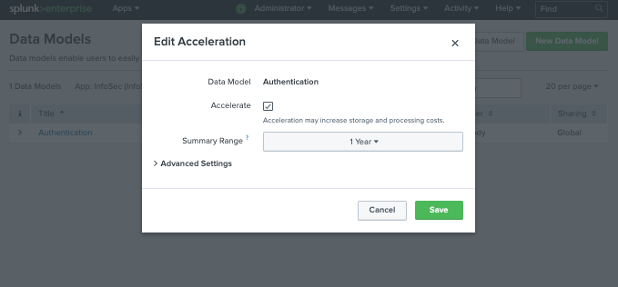

Splunk will start building the data model accelerations. You can track the progress of the accelerations from within the `Health` dashboard of the InfoSec app.

The InfoSec app should now be configured to work with your data sources.

As a final step, view each of the InfoSec dashboards starting with `Security Posture` from the InfoSec app menu and confirm all dashboards are being populated with data. If you come across a dashboard that is not being populated, please see the [Troubleshooting](6 - Support.md#troubleshooting) section to identify if this can be resolved. It may just be that you do not have the required data source within Splunk to feed the dashboard. 