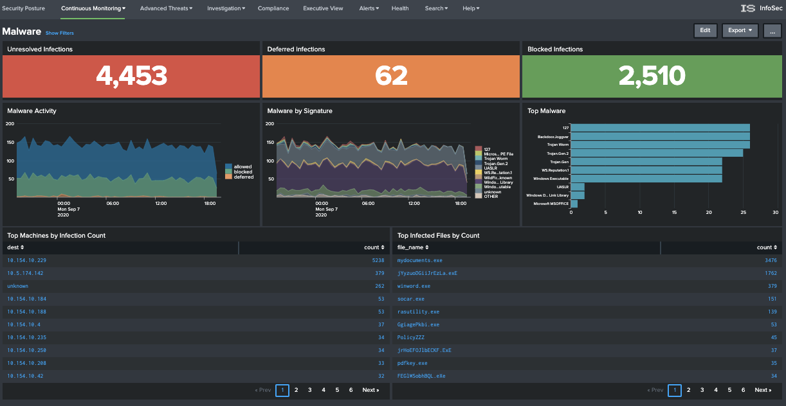
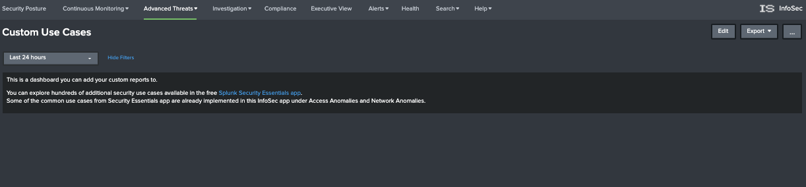
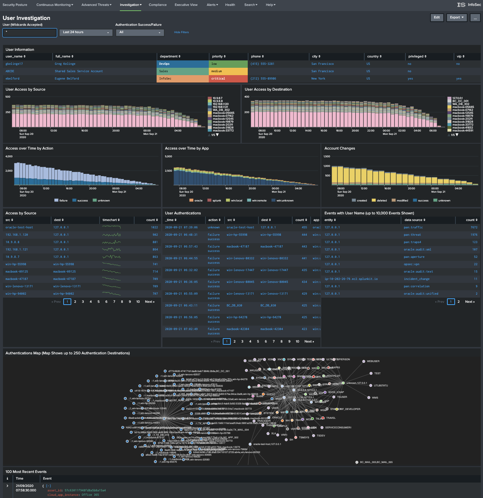
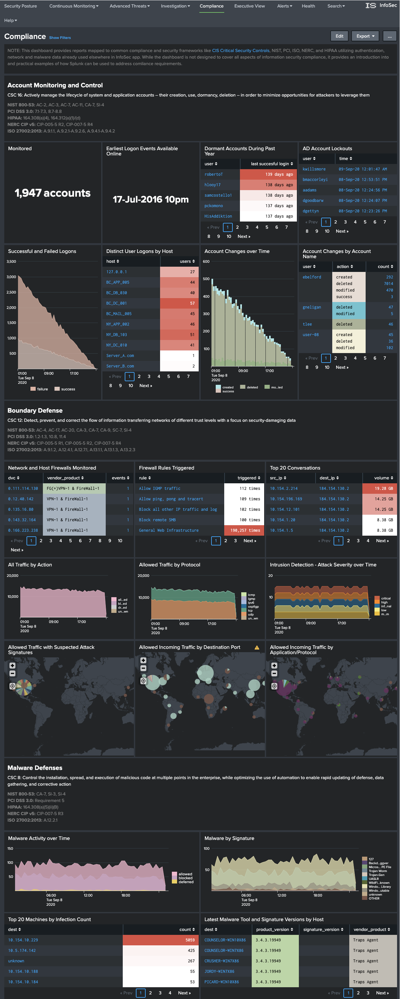
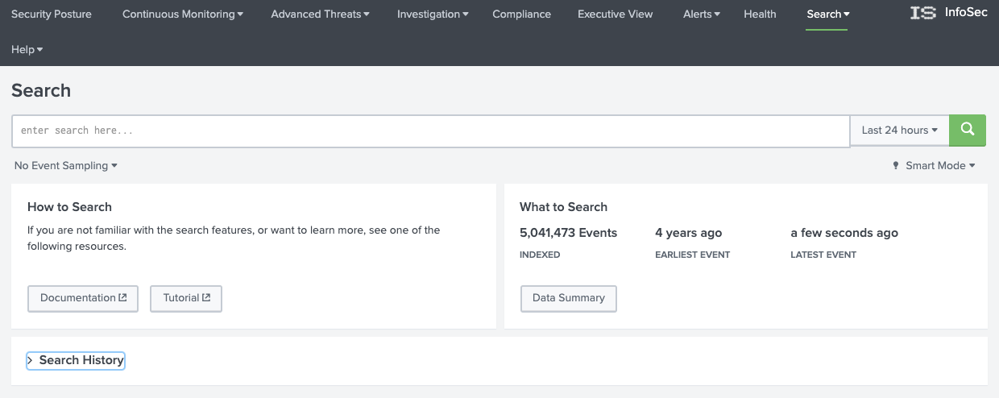
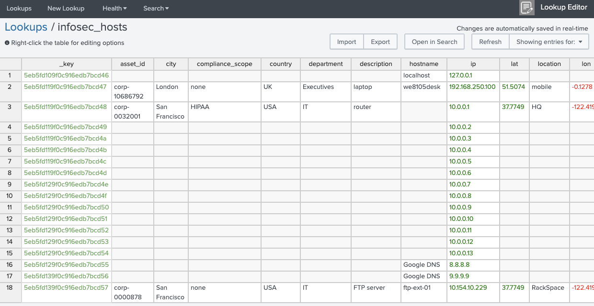

##Using the InfoSec app

###Security Posture

As the title suggests, the Security Posture dashboard provides a high-level view of your security posture. At the top of the dashboard there are two rows of indicators. The top-most row displays statistical counts of events covering your Intrusion Detection System (IDS), Antivirus and Malware systems. Each indicator shows the current state, with an arrow identifying the rate of change (positive, neutral, or negative) and the previously recorded statistic from 24 hours ago.

The second row of indicators displays the number of detected hosts and devices, along with the number of detected accounts being monitored. Each indicator also includes the 24-hour trend and previous result for comparative purposes.

Clicking on any of these indicators will open a new dashboard with more detailed information.

Together, these two rows of indicators give you an immediate view of the state of your environment compared to how it looked yesterday.

The next row includes three dashboards that focus on Intrusion alerts, splitting and breaking down the reporting into a statistical count of the total "Alerts by Severity", a 24-hour view of those alerts over time, and the Top-10 most critical alerts charted over the same 24 hour window.

Clicking on any of these dashboards will open a new window that focuses on your IDS.

The last row contains two punchcard style dashboards that focus on account and asset information within your organisation. For these dashboards to populate, the punchcard visualisation has to have been installed and enabled within your Splunk instance. If you do not see the punchcard visualisation matching the above screenshot, it may indicate that this visualisation has not been installed or may have been disabled. You may see the message "No matching visualization found for type: punchcard, in app: punchcard_app". Installing this app will be discussed [later](# Supporting apps and add-ons).

These two dashboards provide a swim-lane style view of the type and count of events being detected against your identities and assets over the past 24 hours. These two dashboards allow you to quickly identify bursts of activity that may need investigating.

###Continuous Monitoring

####Windows Access and Changes

	
The `Windows Access and Changes` dashboard focuses on events within your Microsoft Windows environment. It presents information relating to:
	
 * Locked Out Accounts
 * Privilege Escalations
 * Change metrics
 * Authentication metrics

By default, this and other dashboards within the InfoSec app default the search time period to `Last 24 hours`. You can access and modify the search filters associated with these dashboards by selecting `Show Filters` near the title of each dashboard (see below).

     
####All Authentications

	
The `All Authentications` dashboard provides a consolidated view of authentication actions across all data sources. This dashboard will assist in identifying authentication anomalies within your environment or problem accounts repeatedly failing to login.
	
The second part of the dashboard provides an interactive filter allowing you to filter by `User`, `Host`, `Action` and a frequency criteria (e.g. `Authenticating against 5 or more hosts`.
	
Selecting an identity or host/asset will take you to either the `User Investigation` or `Host Investigation` dashboards.
	
####Malware

The `Malware` dashboard provides a consolidated view of your antivirus solutions over the last 24 hours.

The first row of the dashboard displays the count of `Unresolved`, `Deferred` and `Blocked` infections. These metrics a derived from the `action` field of the `Malware` data model. Clicking on an action will constrain the results for rest of the dashboards to the selected action.

Selecting a destination will take you to the `Host Investigation` dashboard. Selecting anything else within the presented dashboards will display the underlying results within a Splunk search window.
	
####Intrusion Detection (IDS/IPS)

The `Intrusion Detection (IDS/IPS)` dashboard provides a consolidated view across all IDS/IPS systems within your environment. This data would typically come from your NG Firewall solutions and dedicated IPS solutions like Snort, Suricata, Darktrace, etc.

The first row provides a breakdown of the total events by action over the last 24 hours. Clicking on an action will constrain the results in the other dashboards to the selected action.

The second row provides a breakdown of the total events by severity. Clicking on an severity will also constrain the results presented in the other dashboards to the selected severity.

Clicking on any of the displayed data will pivot to the results in a Splunk search window.
	
####Firewalls

The `Firewalls` dashboard provides a high-level consolidated view of all firewall events within your organisation.

The first row displays a breakdown by action (Blocked and Allowed) as well as total counts for source and destination IP's. Only the `action` values are selectable, which will constrain the other dashboards to the selected action.

The displayed results are geo-tagged to country.

Clicking on any of the presented results will pivot to displaying the results in an underlying Splunk search.
	
####Network Traffic

The `Network Traffic` dashboard will display your firewall data in more detail. Clicking on any source or destination will pivot to the `Host Investigation` dashboard.

The second half of the dashboard allows you to filter and investigate the firewall detailed results through a series of filters.

A communications map will display the relationship of the filtered results.
	
####VPN Access
	

The `VPN` dashboard will present VPN session data from all monitored data sources.

Included within the dashboard is a list of geographically improbably VPN connections.

The VPN data can be filtered by user and selecting any of the presented results will pivot to displaying the results in Splunk search.
	
###Advanced Threats

The `Advanced Threat` dashboards applies the power of Splunk's search capabilities to highlight security events of interest. Searches 

####Access Anomalies

The `Access Anomalies` dashboard identifies events that could potentially pose a security risk. Searches look to identify:

* Spikes or out of character increases in access to hosts
* Brute force attacks by source or user
* Accounts that have high percentage of logon failures vs success
* Users performing new privileged actions
* Geographically improbably access 
	
####Network Anomalies

The `Network Anomalies` dashboard identifies:

* Spikes in access to destinations
* Suspected network scanning
* BOT/C2 network indicators
* SMB and DNS anomalies
	
####Custom Use Cases

The `Custom Use Cases` dashboard starts as a blank canvas for you to incorporate your own searches and dashboards. You can incorporate searches from the [Splunk Security Essentials](https://splunkbase.splunk.com/app/3435/) app into this dashboard. You can follow the example of [adding a custom search](###adding-a-custom-search)
	
###Investigation

The `User Investigation` and `Host Investigation` dashboards provide an interface to investigate user and host-based behaviours and actions. Entry to these dashboards will normally occur through a drilldown from one of the other dashboards within the InfoSec app but you can navigate to the dashboards directly and search using the provided filters.

Selecting any represented data within these two dashboards will either drill-down to that user or host, or display the results of the underlying Splunk search.

####User Investigation

	
####Host Investigation

	
###Compliance

The `Compliance` dashboard provides visibility into controls that are often required under different compliance frameworks. This dashboard can be edited and changed to meet your needs. If you perform regular audits, you may want to add to this dashboard the searches that you use to respond to the audits.

###Executive View

The executive view dashboard provides a high-level view of certain security metrics, reporting on the status of the environment.

###Alerts

The `Alerts` dashboard allows you to investigate and manage alerts raised by the InfoSec app.

Alerts are regularly running scheduled searches that are looking for matching events within your data. You can drill-down to the current alerts defined within the InfoSec app and modify or add to them through this dashboard.

Any search that you create within Splunk can be saved as an alert. All alerts need to include a search schedule. When creating an alert, Splunk offers you a selection of times that a search can run. Selecting the cron schedule allows you to set the scheduled frequency as often as every minute. 

Although there is an option to schedule real-time searches, this should normally be avoided.

This [video](https://youtu.be/0REbozaALX0) covers the steps required to create a new alert.

You may want to consider using the [Alert Manager](https://splunkbase.splunk.com/app/2665/) app in conjunction with the InfoSec app to provide a more feature rich alert management framework.

###Health

The `Health` dashboard provides a health-check view of your Splunk environment as it relates to the requirements of the InfoSec app. The dashboard can provide an indication of any issues that may impact the proper functioning of the InfoSec app. It will identify the source and type of data being indexed by your Splunk environment. It will show you which data models are being fed with data and show you the status of each of the required data models.

###Search

####Search

The InfoSec app provides a standard Splunk search page from within the App. If you're unfamiliar with how to search in Splunk, this [introductory video](https://www.splunk.com/en_us/resources/videos/search-filter-and-correlate.html) may help.

Please also see [Training](#Training).
	
####Dashboards

The `Dashboards` page will list all saved dashboards within Splunk. From here, you can:

* Open and view a dashboard
* Adjust who can access a dashboard by modifying it's permissions
* Edit a dashboard
* Clone a dashboard
	
####Lookups

The InfoSec app comes bundled with a number of lookups that are used to enrich the event data within your environment. There are two lookups that can be modified to provide additional context when viewing certain data within the InfoSec app. These lookups are:

* Host

The host lookup allows you to manually enter context associated with your organisation's assets. You can record fields such as location, description, owner, priority, make and model. The information in this lookup table is mapped to events within Splunk through the IP address of the host.

Although you can configure this lookup manually through the InfoSec app, at some point you may want to write a search that regularly populates this lookup from Active Directory and/or other sources.

Modifying the lookups within InfoSec app is only possible if you have installed the [Lookup File Editor](https://splunkbase.splunk.com/app/1724) app.

* User

Similar to the `Host` lookup, the `User` lookup enriches the user event data within your Splunk environment with additional information that can assist you, or your security analysts with triaging and actioning invents under investigation. It allows you to record fields such as full-name, phone number, email address, priority, among others.

Although you can configure this lookup manually through the InfoSec app, at some point you may want to write a search that regularly populates this lookup from Active Directory and/or other sources.

Modifying the lookups within InfoSec app is only possible if you have installed the [Lookup File Editor](https://splunkbase.splunk.com/app/1724) app.
	
####Experimental Dashboards

There are also a number of experimental dashboards within the InfoSec app. Consider this a sampler of newer dashboards that are under development. These dashboards may eventually be moved and incorporated into other parts of the InfoSec app.
	
###Help

The `Help` menu will provide you with links to documentation and instructions on configuring the InfoSec app. Please look through the information provided prior to reaching out to the developer.
