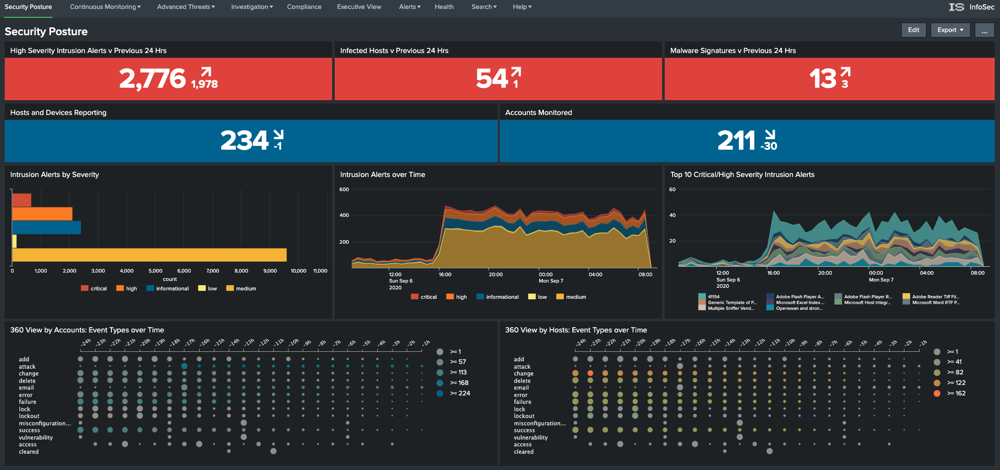
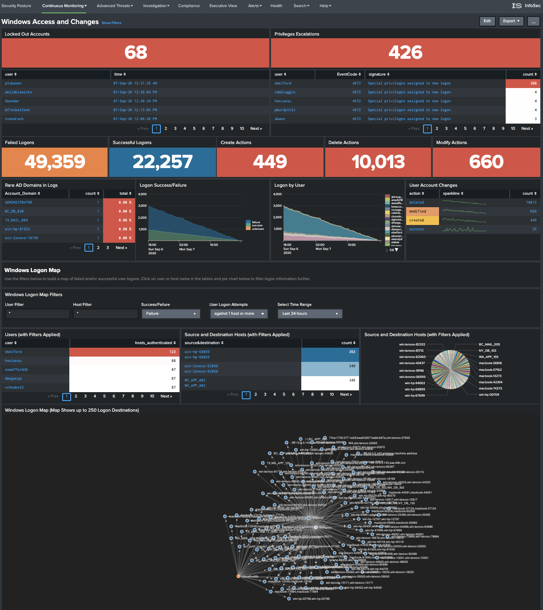

# Welcome to the InfoSec app for Splunk!

The [InfoSec App for Splunk](https://splunkbase.splunk.com/app/4240/) is a free app for the Splunk platform which can be downloaded and installed into your Splunk environment. It is available from [Splunkbase](https://splunkbase.splunk.com/).

The InfoSec App for Splunk is not to be confused with [Enterprise Security](https://www.splunk.com/en_us/software/enterprise-security.html), Splunk's premium security solution.

InfoSec app for Splunk is an entry, or starter level security solution powered by the Splunk platform. It is
designed to adddress the most common security use cases, including continuous monitoring and security investigations. InfoSec app also includes a number of advanced threat detection use cases that can be further expanded using security resources available for Splunk like the [Security Essentials app for Splunk](https://splunkbase.splunk.com/app/3435/):

## Product Goals

The InfoSec app for Splunk aims to achieve the following:

* Provide an entry level security solution to new and existing Splunk customers that are not yet ready or ble to invest in Splunk's Enterprise Security platform.
* Make it easy to direct Splunk's powerfull features towards security.
* Provide a single pane view of your security events.
* Allow the user to investigate security alerts and incidents.
* Provide a base platform that can be customised and expanded to meet your security needs using additional apps and add-ons from Splunkbase.

## Before we start

This documentation is not designed to replace formal training or Splunk's own documentation. It focusses on the introductory steps and knowledge required to get the InfoSec app upp and running in a short amount of time. It assumes the user is fairly new to Splunk and may not have yet grasped many of Splunk's fundamental concepts. Consider this documentation as a fast-start guide to getting the InfoSec app up and running within your environment. This documentation will introduce you to key Splunk concepts, lightly touching on each. Links will be provided to Splunk's documentation so you can delve further into Splunk's capabilities, as required. Although this document focuses on the InfoSec App for Splunk, the topics covered can be applied to other apps and configurations within Splunk.

## Introduction to the InfoSec app

The InfoSec app provides the user with a number of pre-configured and customisable security focussed dashboards. 

* Overview

Description

[** Video **]

* Security Posture

As the title suggests, the Security Posture dashboard provides a high-level view of your security posture. At the top of the dashboard there are two rows of indicators. The top-most row displays statistical counts of events covering your Intrusion Detection System (IDS), AntiVirus and Malware systems. Each indicator shows the current state, with an arrow identifying the rate of change (positive, neutral, or negative) and the previously recorded statistic from 24 hours ago.

The second row of indicators displays the number of detected hosts and devices, along with the number of detected accounts being monitord. Each indicator also includes the 24 hour trend and previous result for comparative purposes.

Clicking on any of these indicators will open a new dashboard with more detailed information.

Together, these two rows of indicators gives you an immediate view of the state of your environment compared to how it looked yesterday.

The next row includes three dashboards that focus on Intrusion alerts, splitting and breaking down the reporting into a statistical count of the total "Alerts by Severity", a 24 hour view of those alerts over time, and the Top-10 most critical alerts charted over the same 24 hour window.

Clicking on any of these dashboards will open a new window that focuses on your IDS.

The last row contains two punchcard style dashboards that focus on account and asset information within your organisation. For these dashboards to populate, the punchcard visualisation has to have been installed and enabled within your Splunk instance. If you do not see the punchcard visualisation matching the above screen-shot, it may indicate that this visualition has not been installed or may have been disabled. You may see the message "No matching visualization found for type: punchcard, in app: punchcard_app". Installing this app will be discussed [later](# Supporting apps and add-ons).

These two dashboards provide a swimlane style view of the type and count of events being detected against your identities and assets over the past 24 hours. These two dashboards allow you to quickly identify bursts of activity that may need investigating.

* Continuous Monitoring
	* Windows Access and Changes

	
	
	* All Authentications
	* Malware
	* Intrusion Detection (IDS/IPS)
	* Firewalls
	* Network Traffic
* Advanced Threats
	* Access Anomalies
	* Network Anomalies
	* Custom Use Cases
* Investigation
	* user Investigation
	* Host Investigation
* Compliance
* Executive View
* Alerts
* Health
* Search
	* Search
	* Dashboards
	* Lookups
	* Experimental Dashboards
* Help

## Getting Data In

### Forwarders
### HTTP Event Collector (HEC)
### Apps and Add-ons

* Introduction to Apps and Add-ons
* Splunkbase
* Installing Apps and Add-ons

### Inputs Data Manager (IDM)

**Splunk supported Add-ons**

[Full list can be found here](https://docs.splunk.com/Documentation/AddOns)

## Installation

Notes:

IMPORTANT: PREREQUISITES

At a minimum, you should have data from the following security sources collected by your Splunk environment:

Firewall data like Cisco ASA, Palo Alto Networks, Check Point, Juniper, Fortinet, etc.
Active Directory security logs (make sure that your audit policy enables logging failed and successful authentication attempts)
Antivirus/Malware data like McAfee, Symantec, Trend Micro, etc.
All data used by InfoSec app must be Common Information Model (CIM)-compliant. The easiest way to accomplish that is to use CIM-compliant Splunk Add-ons for your security devices *(*** See Splunkbase list of CIM add-ons ***)
*

The following free Splunk Add-ons must be installed before you can start using InfoSec App:
Splunk Common Information Model (CIM): https://splunkbase.splunk.com/app/1621/
Punchcard visualization: https://splunkbase.splunk.com/app/3129/
Force Directed visualization: https://splunkbase.splunk.com/app/3767/
Lookup File Editor: https://splunkbase.splunk.com/app/1724/ (new requirement starting from InfoSec v1.5)
Sankey Diagram visualization: https://splunkbase.splunk.com/app/3112/ (new optional prerequisite for the experimental VPN Access dashboard starting from v1.5.3)
The following Data Models must be accelerated:

Authentication
Change (for app version 1.6.x and newer) or Change Analysis (for app version 1.5.3 and older)
Intrusion_Detection
Malware
Network_Sessions
Network_Traffic
Endpoint
Web (new requirement starting from InfoSec v1.5)

WHERE TO INSTALL THE APP

The app can be installed on a standalone Splunk server, a Search Head or a Search Head Cluster. In a distributed environment do not install the app on Indexers; the app should only be installed on Search Head(s).

### Supporting apps and add-ons

Required add-ons and apps:
- Splunk Common Information Model (CIM)

- Punchcard visualization

- Force Directed visualization

- Lookup File Editor

### required Data Sources

- Firewall, IDS/IPS data (e.g. Cisco, Palo Alto Networks, Check Point, Fortinet, Juniper)

- Active Directory data (Windows logs from Domain Controllers)

- Malware/antivirus tools data (e.g. Symantec, McAfee, Sophos, Trend Micro)

## Configuration

### Data Sources

- Microsoft365 or AD
- Linux Authentication
- Windows Security Logs
- Palo Alto Firewall
- Symantec Endpoint Protection
- Suricata IDS

### Common Information Model (CIM)

The Splunk Common Information Model (CIM) is a shared semantic model focused on extracting value from data. The CIM is implemented as an add-on that contains a collection of data models (we'll get to what that means soon), documentation, and tools that support the consistent, normalized treatment of data for maximum efficiency at search time.

The InfoSec app relies on the CIM to function properly. If you have not yet installed the CIM to support the InfoSec app. Please look at the [Installation Instructions](#Installation).

If you'd like to watch a short video explaining the value and use of the CIM, Splunk Education has published one to Youtube [here](https://www.youtube.com/watch?v=QTklD7OiN74) (8:30 mins). The video also covers installation and configuration of the CIM.

The CIM add-on contains a collection of preconfigured data models that you can apply to your data at search time. Each data model in the CIM consists of a set of field names and tags that define the least common denominator of a domain of interest. You can use these data models to normalize and validate data at search time, accelerate key data in searches and dashboards, or create new reports and visualizations with Pivot.

The add-on also contains several tools that are intended to make analysis, validation, and alerting easier and more consistent. These tools include a custom command for CIM validation and a common action model, which is the common information model for custom alert actions. See Approaches to using the CIM for more information about the tools available in the CIM add-on.

### Indexes

### Sourcetypes

### Sources

### Fields

### Eventtypes

### Tags

### Permissions, users, roles and apps

### Macros

### Datamodels and acceleration

### Configuration Files

### The data pipeline

### Alerts

## Using the InfoSec app

## Troubleshooting

## Support

* The InfoSec App for Splunk is built by [Splunk Works](https://splunkbase.splunk.com/apps/#/author/splunklabs) and is developer supported. More information on support can be found on [Splunkbase](https://splunkbase.splunk.com/app/4240/#/details).

If you have issues and require some assistance post a question to [Splunk Answers](https://community.splunk.com) using the tag "[InfoSec App for Splunk](https://community.splunk.com/t5/tag/InfoSec%20App%20for%20Splunk/tg-p)" before contacting the developer.

Get involved, try it out, ask questions, and make
new friends!

## Contributing

We welcome feedback and contributions from the community! Please see our
[contribution guidelines](CONTRIBUTING.md) for more information on how
to get involved.
