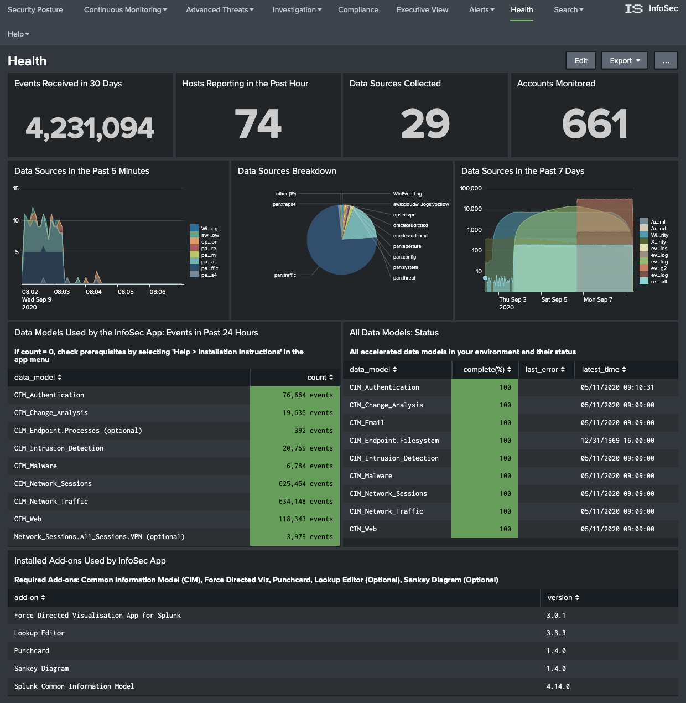
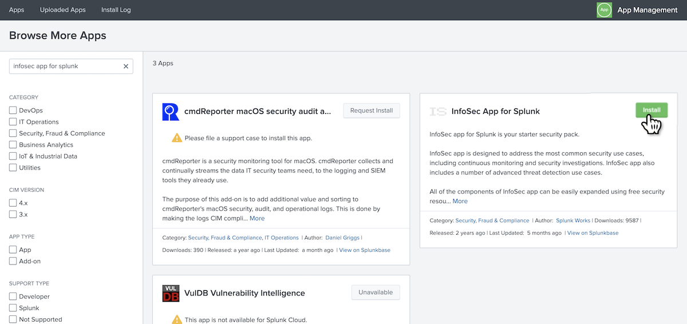
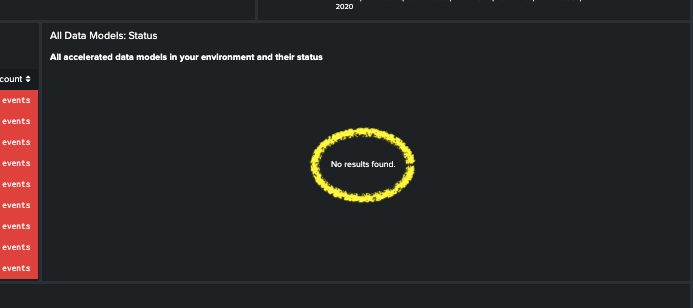
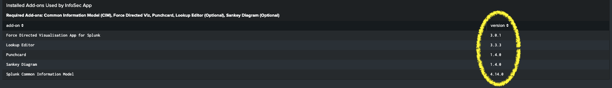

# Welcome to the InfoSec app for Splunk!

The [InfoSec App for Splunk](https://splunkbase.splunk.com/app/4240/) is a free app for the Splunk platform which can be downloaded and installed into your Splunk environment. It is available from [Splunkbase](https://splunkbase.splunk.com/).

The InfoSec App for Splunk should not to be confused with [Enterprise Security](https://www.splunk.com/en_us/software/enterprise-security.html), Splunk's premium security solution. Although both solutions are security solutions, the features and capabilities of Enterprise Security are significantly deeper than what is available within the InfoSec app.

InfoSec app for Splunk is an entry, or starter level security solution powered by the Splunk platform. It is
designed to address the most common security use cases, including continuous monitoring and security investigations. InfoSec app also includes a number of advanced threat detection use cases that can be further expanded using security resources available for Splunk like the [Security Essentials app for Splunk](https://splunkbase.splunk.com/app/3435/).

Splunk Apps provide solutions for many common use cases. They provide specialised insight into your data and systems with pre-configured dashboards, reports, data inputs, and saved searches. Apps for Splunk are available from [Splunkbase](https://splunkbase.splunk.com/). The Splunkbase library has 1000+ apps and add-ons from Splunk, our partners, and our community. They can be directly downloaded, installed and configured within your Splunk environment.

## Product Goals

The InfoSec app for Splunk aims to achieve the following:

* Provide an entry level security solution to new and existing Splunk customers that are not yet ready or able to invest in Splunk's Enterprise Security platform.
* Make it easy to direct Splunk's powerful features towards security.
* Provide a single pane view of your security events and posture.
* Allow the user to investigate security alerts and incidents.
* Provide a base platform that can be customised and expanded to meet your security needs using additional apps and add-ons from Splunkbase.

## Before we start

This documentation is not designed to replace formal training or Splunk's own documentation. It focusses on the introductory steps and knowledge required to get the InfoSec app up and running in a short amount of time. It assumes the user is fairly new to Splunk and may not have yet grasped many of Splunk's fundamental concepts. Consider this documentation as a fast-start guide to getting the InfoSec app up and running within your environment. This documentation will introduce you to key Splunk concepts, lightly touching on each. Links will be provided to Splunk's documentation so you can delve further into Splunk's capabilities, as required. Although this document focuses on the InfoSec App for Splunk, the topics covered may be applied to other apps and configurations within Splunk.

## Introduction to the InfoSec app

The InfoSec app provides the user with a number of pre-configured and customisable security focussed dashboards and alerts. 

* Overview

Description

[** Video **]

**Security Posture**

As the title suggests, the Security Posture dashboard provides a high-level view of your security posture. At the top of the dashboard there are two rows of indicators. The top-most row displays statistical counts of events covering your Intrusion Detection System (IDS), AntiVirus and Malware systems. Each indicator shows the current state, with an arrow identifying the rate of change (positive, neutral, or negative) and the previously recorded statistic from 24 hours ago.

The second row of indicators displays the number of detected hosts and devices, along with the number of detected accounts being monitored. Each indicator also includes the 24 hour trend and previous result for comparative purposes.

Clicking on any of these indicators will open a new dashboard with more detailed information.

Together, these two rows of indicators gives you an immediate view of the state of your environment compared to how it looked yesterday.

The next row includes three dashboards that focus on Intrusion alerts, splitting and breaking down the reporting into a statistical count of the total "Alerts by Severity", a 24 hour view of those alerts over time, and the Top-10 most critical alerts charted over the same 24 hour window.

Clicking on any of these dashboards will open a new window that focuses on your IDS.

The last row contains two punchcard style dashboards that focus on account and asset information within your organisation. For these dashboards to populate, the punchcard visualisation has to have been installed and enabled within your Splunk instance. If you do not see the punchcard visualisation matching the above screen-shot, it may indicate that this visualisation has not been installed or may have been disabled. You may see the message "No matching visualization found for type: punchcard, in app: punchcard_app". Installing this app will be discussed [later](# Supporting apps and add-ons).

These two dashboards provide a swim-lane style view of the type and count of events being detected against your identities and assets over the past 24 hours. These two dashboards allow you to quickly identify bursts of activity that may need investigating.

**Continuous Monitoring**

* Windows Access and Changes

	
	
	The Windows Access and Changes dashboard focuses on events within your Microsoft Windows environment. It presents information relating to:
	
 - Locked Out Accounts
      - Privilege Escalations
      - Change and 
     
   * All Authentications

	

	[Description here]
	
	* Malware

	

	[Description here]
	
	* Intrusion Detection (IDS/IPS)

	

	[Description here]
	
	* Firewalls

	

	[Description here]
	
	* Network Traffic

	

	[Description here]
	
	* VPN Access
	
	

	[Description here]
	
* Advanced Threats
	* Access Anomalies

	

	[Description here]
	
	* Network Anomalies

	

	[Description here]
	
	* Custom Use Cases

	

	[Description here]
	
* Investigation
	* user Investigation

	

	[Description here]
	
	* Host Investigation

	

	[Description here]
	
* Compliance

	

	[Description here]

* Executive View

	

	[Description here]

* Alerts

	

	[Description here]

* Incident Posture

	

	[Description here]

* Health

	

	[Description here]

* Search
	* Search

	

	[Description here]
	
	* Dashboards

	

	[Description here]
	
	* Lookups

	

	[Description here]
	
	* Experimental Dashboards

	

	[Description here]
	
* Help

	

	[Description here]

## Getting Data In

### Forwarders
### HTTP Event Collector (HEC)
### Apps and Add-ons

* Introduction to Apps and Add-ons
* Splunkbase
* Installing Apps and Add-ons

### Inputs Data Manager (IDM)

**Splunk supported Add-ons**

[Full list can be found here](https://docs.splunk.com/Documentation/AddOns)

## Installation

**Installation Prerequisites**

The InfoSec app for Splunk can be installed directly into Splunk in the same way as other available apps from [Splunkbase](https://splunkbase.splunk.com/).

It's assumed that you already have Splunk installed somewhere, or you're using Splunk Cloud. This document does not cover installing and configuring Splunk for the first time. If you need to do this before proceeding further, please view the following resources:

* [Installing Splunk on Linux documentation](https://docs.splunk.com/Documentation/Splunk/latest/Installation/InstallonLinux). There's also a video [here](https://www.splunk.com/en_us/training/videos/installing-splunk-enterprise-on-linux.html).

* [Installing Splunk on Windows documentation](https://docs.splunk.com/Documentation/Splunk/latest/Installation/InstallonWindows). There's also a video [here](https://www.splunk.com/en_us/resources/videos/installing-splunk-on-windows.html).

* [Start Splunk Enterprise for the first time](https://docs.splunk.com/Documentation/Splunk/latest/Installation/StartSplunkforthefirsttime)

* [Installing the Splunk Enterprise License](https://docs.splunk.com/Documentation/Splunk/latest/Installation/Installalicense)

* [A short introductory video to using the Splunk web interface](https://www.splunk.com/en_us/resources/videos/splunk-web-demo.html)

**Installation Steps**

The method for installing the InfoSec app will vary slightly between Splunk Enterprise and Splunk Cloud. If there is a difference within the steps. Each will be explained.

1. Log into your Splunk environment with an account that has administrative privileges.

2. Select the App menu within the black menu bar at the top left of the Splunk web user interface (just to the right of the Splunk logo). 

   

3. Select Find More Apps

   
  

4. Within the search menu on the top-left of the page, search for "infosec app for splunk". The InfoSec App for Splunk should be listed as one of the available apps for installation.

   
   
5. Press the green "Install" button for the InfoSec App for Splunk. The process will be slightly different between Splunk Cloud and Splunk Enterprise.

   **Splunk Cloud**

   When asked to confirm, select "Continue".

   **Splunk Enterprise**

   Login with your splunk.com credentials to install the app, not your Splunk Enterprise instance account. You will also need to accept the Terms and Conditions before being able to proceed.
      
   
   
    Note: The ability to install Apps and Add-ons directly into your Splunk environment requires internet connectivity. Your Splunk environment must be able to access https://splunkbase.splunk.com over port TCP/443. If searching for additional apps like the InfoSec app is not producing any results, you may have a problem with Internet connectivity. If the only method of gaining access is through a proxy server, then this must be configured. Instructions on how to configure Splunk to use your HTTP Proxy Server can be found [here](https://docs.splunk.com/Documentation/Splunk/latest/Admin/ConfigureSplunkforproxy).
    
    If configuring Internet access for your Splunk environment is not possible, you can still install apps manually via a two step process. You will need to download the apps from [Splunkbase](https://splunkbase.splunk.com) to your desktop and then install the apps into your Splunk environment via "[Install app from file](https://community.splunk.com/t5/Archive/How-to-install-a-splunk-app/m-p/87912)". This app instalation method is not applicable for Splunk Cloud.

   If you have a larger distributed Splunk Enterprise environment you only need to install the InfoSec app on the search head. It does not need to be installed on the indexers.  
   
The InfoSec app for Splunk should now be installed. To confirm this, select the InfoSec app from the App menu (see step 2, above). You should be presented with the "Security Posture" dashboard.

**Additional Apps and Add-ons**

A number of supporting Splunk Apps and Add-ons from Splunkbase must also be installed before you can start using the InfoSec app. These are:

* [Splunk Common Information Model (CIM)](https://splunkbase.splunk.com/app/1621/)
* [Punchcard visualization](https://splunkbase.splunk.com/app/3129/)
* [Force Directed visualization](https://splunkbase.splunk.com/app/3767/)
* [Lookup File Editor](https://splunkbase.splunk.com/app/1724/) (new requirement starting from InfoSec v1.5)
* [Sankey Diagram visualization](https://splunkbase.splunk.com/app/3112/) (new optional prerequisite for the experimental VPN Access dashboard starting from v1.5.3)

The process to install these additional Apps and Add-ons is the same as you've just completed when installing the InfoSec app. Repeat the above steps to install each of these additional Apps and Add-ons.

Once you've reached this step, you are ready to start configuring the InfoSec App for Splunk.
   

## Configuration

### Data Sources   

Notes:

IMPORTANT: PREREQUISITES

At a minimum, you should have data from the following security sources collected by your Splunk environment:

Firewall data like Cisco ASA, Palo Alto Networks, Check Point, Juniper, Fortinet, etc.
Active Directory security logs (make sure that your audit policy enables logging failed and successful authentication attempts)
Antivirus/Malware data like McAfee, Symantec, Trend Micro, etc.
All data used by InfoSec app must be Common Information Model (CIM)-compliant. The easiest way to accomplish that is to use CIM-compliant Splunk Add-ons for your security devices *(*** See Splunkbase list of CIM add-ons ***)
*

The following Data Models must be accelerated:

Authentication
Change (for app version 1.6.x and newer) or Change Analysis (for app version 1.5.3 and older)
Intrusion_Detection
Malware
Network_Sessions
Network_Traffic
Endpoint
Web (new requirement starting from InfoSec v1.5)

### required Data Sources

- Firewall, IDS/IPS data (e.g. Cisco, Palo Alto Networks, Check Point, Fortinet, Juniper)

- Active Directory data (Windows logs from Domain Controllers)

- Malware/antivirus tools data (e.g. Symantec, McAfee, Sophos, Trend Micro)

- Microsoft365 or AD
- Linux Authentication
- Windows Security Logs
- Palo Alto Firewall
- Symantec Endpoint Protection
- Suricata IDS

##Concepts and definitions

The InfoSec app relies on accelerated data models and the Common Information model (CIM) to provide a consistent and normalised view into the event data that you'll bring into Splunk. Understanding how to configure and use the CIM and data models may require an understanding of indexes, source types, sources, fields, event types, tags, macros and a few other concepts, depending on the data sources that you are feeding into Splunk.

Splunk provides a [Splexicon](https://docs.splunk.com/Splexicon), which is a glossary of technical terminology that is specific to Splunk software. Definitions within the Splexicon include links to related information in the Splunk documentation.

A high-level overview of some of some of this terminology is provided below to assist with understanding how to configure and troubleshoot the installation of the InfoSec app. If you are familiar with these Splunk concepts, skip to [Configuration](##Configuration).

###Kowledge Objects

A knowledge object is a user-defined entity that enriches the existing event data within Splunk. Knowledge objects include saved searches, event types, tags, field extractions, lookups, reports, alerts, data models and workflow actions. The term knowledge object refers to these objects within Splunk's language and documentation. Further information can be found [here](https://docs.splunk.com/Splexicon:Knowledgeobject).

Splunk's documentation will also refer to a knowledge manager, who is someone with administrative, or power user, privileges who can share and manage the permissions of knowledge objects. 
 
###Common Information Model (CIM)

The Splunk Common Information Model (CIM) is a shared semantic model focused on extracting value from data. The CIM is implemented as an add-on that contains a collection of data models (we'll get to what that means soon), documentation, and tools that support the consistent, normalised treatment of data for maximum efficiency at search time.

The InfoSec app relies on the CIM to function properly. If you have not yet installed the CIM to support the InfoSec app. Please look at the [Installation Instructions](#Installation).

Splunk Education has published a short video explaining the value and use of the CIM,  one to Youtube [here](https://www.youtube.com/watch?v=QTklD7OiN74) (8:30 mins). The video also covers installation and configuration of the CIM.

The CIM add-on contains a collection of preconfigured data models that you can apply to your data at search time. Each data model in the CIM consists of a set of field names and tags that define the least common denominator of a domain of interest. You can use these data models to normalise and validate data at search time, accelerate key data in searches and dashboards, or create new reports and visualisations with Pivot.

The add-on also contains several tools that are intended to make analysis, validation, and alerting easier and more consistent. These tools include a custom command for CIM validation and a common action model, which is the common information model for custom alert actions. See [Approaches to using the CIM](https://docs.splunk.com/Documentation/CIM/latest/User/HowtouseCIM) for more information about the tools available in the CIM add-on.

For the InfoSec app to correctly report on the data that you have in Splunk, that data must be present within the supporting data models which means the data must be CIM compliant.

###Index

Splunk stores your data in indexes as events. The default index in splunk is called "main". Splunk will store your event data in this main index if you don't tell Splunk to put it anywhere else. You can create and specify other indexes for different data inputs. There are several key reasons for having multiple indexes:

* To control user access.
* To accommodate varying retention policies.
* To speed searches in certain situations.

When configuring data models in Splunk, in most cases, you would restrict each datamodel to just the indexes that contain the data that populates the data model.

Further information on using, creating and manageing indexes in Splunk can be found [here](https://docs.splunk.com/Documentation/Splunk/latest/Indexer/Setupmultipleindexes).

###Source type

A source type is used to name or identify each different type of data in Splunk. The definition of a sourcetype will define how the timestamp is interpreted, what defines the break between different events and how Splunk might decipher and understand the structure of events. A source type could be considered the fingerprint or DNA of the event data entering Splunk. When configuring Splunk to receive or index data, you will always define a source type, or a source type may be pre-defined within an Add-on that you've chosen to use to help you onboard data into Splunk. As an example, the source types defined within the Splunk Add-on for Windows are listed within Splunk's documentation [here](https://docs.splunk.com/Documentation/WindowsAddOn/latest/User/SourcetypesandCIMdatamodelinfo).

Some source types may be structured, such as json, XML or CSV whereas others may have no structure.

This [blog post](https://www.splunk.com/en_us/blog/tips-and-tricks/sourcetypes-whats-in-name.html) provides a good introduction to source types with Splunk.

Splunk software ships with a set of built-in source types that are known as [pretrained source types](https://docs.splunk.com/Documentation/Splunk/latest/Data/Listofpretrainedsourcetypes).

###Source

A source in Splunk is not to be confused with source type. Where a source type identifies the structure of events or data within Splunk, the source identifies where that event data has come from. The source is the name of the file, stream or other input from which a particular event has cme from. The below is an example of the difference between source and sourcetype

`source=/var/log/messages and sourcetype=linux_syslog`

Every event in Splunk will have a pre-defined index, host, source, sourcetype and _time field. For more information, see [default fields](https://docs.splunk.com/Splexicon:Defaultfield).

###Host

Within Splunk, all event data will be asigned to a host. The host identifies the network device that collected the data for Splunk. It may be a hostname or IP address. Further information can be found in the [Splunk documentation](https://docs.splunk.com/Documentation/Splunk/8.0.5/Data/Abouthosts). The host field is considered a [default fields](https://docs.splunk.com/Splexicon:Defaultfield).

###Field

Fields appear in event data as searchable name-value pairings such as `user_name=fred`. Fields are the building blocks of Splunk searches, reports and data models.

Splunk will attempt to auto-extract values into fields from within the event data that is being indexed. This is normally performed at search time.

Fields will often be defined within event data as key value pairs such as `user=fred` or `src:192.168.10.5` or may simply be a number or text within the structure of the event with no defined key. Splunk can still identify these fields using a custom [field extraction](https://docs.splunk.com/Splexicon:Fieldextraction) through Splunk web. A field extraction is defined against a source type, a source or a host.

Further information on fields in Splunk can be found [here](https://docs.splunk.com/Documentation/Splunk/latest/Knowledge/Aboutfields).

The values from fields within event data are used populate enabled data models within Splunk. 

Often, fields defined as key value pairs within event data may not align with the naming standard defined within the CIM and data models. In order to work with this event data the names of these fields needs to be be changed to conform with the CIM naming standard. This can be done using Aliases.

###Alias

An alias (or field alias) in Splunk is an alternate name assigned to a field that has been extracted from the event data within a Splunk index. Field aliases for fields can be defined against a source type, a source or a host. They can be defined within Splunk web by going into the Settings -> Fields menu. If you are working with a data source that is not yet CIM compliant, you may need to create field aliases to map existing fields within your data source to the [CIM naming convention](https://docs.splunk.com/Documentation/CIM/latest/User/CIMfields).

See Splunk's [documentation on Fields](https://docs.splunk.com/Documentation/Splunk/latest/Knowledge/Abouttagsandaliases) for further information.

###Event type

An event type in Splunk is a category of events united by the same search. Event types are useful for categorising a subset of event data from within one source type, or uniting events of a certain type across multiple source types. Event types and tags go hand-in-hand in asisting with preparing data for use in data models.

This is an older Splunk [video](https://www.youtube.com/watch?v=KhdMgT9VbHs) that covers the subject of event types.

See Splunk's [documentation on event types](https://docs.splunk.com/Documentation/Splunk/latest/Knowledge/Abouteventtypes) for further information.

###Tags

Tags enable you to assign names to specific field and value combinations. This includes event type, host, source and source type field value combinations. Tags tend to work hand-in-hand with event types.
An example of the use of tags might be to create an `authentication` tag that matches:

	eventtype=windows_successful_login
	eventtype=windows_failed_login
	eventtype=vpn_successful_login
	eventtype=vpn_failed_login
	
A search within Splunk for `tag = authentication` will return all events that match any of the above event types.

See Splunk's [documentation on tags](https://docs.splunk.com/Documentation/Splunk/latest/Knowledge/Abouttagsandaliases) for further information.

###Permissions, users and roles

Permissions within Splunk define who has access to data and knowledge objects. Roles within Splunk are given permission to access data within indexes and access apps and knowledge objects. Splunk users inherit the permissions granted to the roles that have been assigned to the user.

When first created within Splunk web, knowledge objects are private and only accessible to the user that created them. A Splunk knowledge manager can share these objects with other Splunk users by adjusting the permissions of the objects. Knowledge objects can be shared with individual roles, or everyone. Knowledge objects can also be restricted to be available within a single app, or globally.

Permissions for knowledge objects can be managed through the Settings menu within Splunk web.

Further information can be found in Spunk's [documentation](https://docs.splunk.com/Splexicon:Permissions).

###Apps

An App is a collection Splunk configurations designed to address a use-case with Splunk. The InfoSec App for Splunk is an example of a Splunk app. An app may contain combinations of dashboards, reports, alerts, knowledge objects, lookups, scripted inputs, menus and other components. Together, these components form a functioning application within the Splunk platform. In the same way that roles are given permissions to access and use knowledge objects, Splunk users can only access the apps (and the included knowledge obejects) that they have been given permission to use. You can create your own apps in Splunk, or download and install apps from [Splunkbase](https://splunkbase.splunk.com).

When browsing Splunkbase, you may notics that there are two types of apps and that the app contents can include Inputs, Alert Actions and Visualisations.

   

All these are considered to be Splunk apps. An Add-on is just an app designed to provide additional capabilities to the Splunk platform, such as getting data in, or providing saved searches or macros. A Splunk app is a packaged up directory of Splunk configuration files and any required supporting objects. The configurations might include dashboards and alerts, they may include javascript or something else that enables an additional visualisation type within Splunk, or code that enables communications with an external alerting framework or third-party application. Regardless of the content of the app, installation and configuration of the app in Splunk is handled in the same way.

###Macros

Search macros contain snippets of searches for re-use in other Splunk searches. A search macro is referenced in other searches through its name. You enclose the name of a search macro within the back-tick character to reference it in another search. As an example, you could create a search macro named `iis_logs` with the following definition:

    (index=windows OR index=dmz sourcetype=iis)

When searching for events within Splunk, you can reference the macro within your search

    `iis_logs` cs_username="fred"
    
Splunk will expand the macro when performing the search resulting the foloowing search being run

    (index=windows OR index=dmz sourcetype=iis) cs_username="fred"

data models make use of search macros to define what data should be included within the data model.

Further information can be found in Splunk's [documentation](https://docs.splunk.com/Splexicon:Searchmacro).

###Datamodels and acceleration

A data model is a form of knowledge object that applies structure to the event data within Splunk. each data model within Splunk represents a category of event data (e.g. authentication data). Data models are powered by root searches that define what data is represented and available within the data model. The data model overlays a schema onto the event data identified by the base search and presents the data to the user as columns of fields over rows of data. Splunk's pivot and datasets interface can be used to query data models to build visualisations and reports.

The schema that is applied to the event data in the form of a data model can be accelerated in Splunk. This is called an accelerated data model. Accelerated data models power apps such as Enterprise Security and the infoSec app. A data model that has been accelerated cannot be edited. If you need to edit an accelerated data model, you must disable acceleration.

Splunk accelerates data models by running regular scheduled searches (every 5 minutes) across the underlying event data, building data sumaries behind the scene with the help of Splunk's high performance analytics store functionality.

Data models can only be accelerated if they are shared and not private.

Further information can be found in Splunk's [documentation](https://docs.splunk.com/.Splexicon:Datamodel).

###Configuration Files

All configuration settings within Splunk are stored within configuration files that can be manually edited. Interacting and managing Splunk through the Splunk web interface simplifies the management of the underlying configuration files. If you are using Splunk Cloud, you actually don't have access to the underlying configurations files within Splunk and must perform all management tasks through Splunk web.

Whether you are using Splunk Cloud or Splunk Enterprise, there will still be times where you will need to modify a configuration file to perform some task within Splunk. Modifying configuration files is most often associated with [getting data in](https://docs.splunk.com/Documentation/SplunkCloud/8.0.2007/Admin/IntroGDI).

Splunk configuration files are stored within the `etc` directory within the Splunk installation directory. Under Linux, this defaults to `/opt/splunk`. Under Windows, this defaults to `C:\Program Files\Splunk`. Modifying configuration files within the Splunk directory often requires the Splunk service to be restarted so that Splunk adopts the changes that you have made.

Splunk applies an [order of precedence](https://docs.splunk.com/Documentation/Splunk/latest/Admin/Wheretofindtheconfigurationfiles) to configuration files to allow `default` configurations to be overridden by `local` configurations. It is Splunk best-practice to never modify a `default` configuration. A Splunk administrator should always copy the settings into a `local` copy of the configuration file.

Further information can be found [here](https://docs.splunk.com/Splexicon:Configurationfile#:~:text=A%20file%20(also%20referred%20to,SPLUNK_HOME%2Fetc%2Fsystem%2Fdefault).

###The data pipeline

The Splunk data pipeline describes the route that data takes moving from its original source to its transformation into searchable events that encapsulate valuable knowledge. The data pipeline includes these segments:

* [Input](https://docs.splunk.com/Splexicon:Input)
* [Parsing](https://docs.splunk.com/Splexicon:Parsing)
* [Indexing](https://docs.splunk.com/Splexicon:Index)
* [Search](https://docs.splunk.com/Splexicon:Search)

###Alerts

Alerts in Splunk are used to monitor and respond to specific events that are detected by a saved search that is run at a scheduled time. An alert will initiate one or more alert actions when the alert triggers.

The InfoSec app utilises alerts to detect notable events within your data.

Further information on working with Alerts can be found in Splunk's [documentation](https://docs.splunk.com/Documentation/Splunk/latest/Alert/Aboutalerts).

##Configuration

After performing the installation steps documented above, start by confirming the Health of the InfoSec app within your environment. 

1. Navigate to the InfoSec app by selecting the `InfoSec` app from the App menu at the top of the Splunk web interface.

	
	
2. Select the `Health` dashboard from within the InfoSec app.

	

The first two rows of visuals within the Health dashboard dashboard will give you an indication of the data within your Splunk environment.

There are three metrics on this dashboard that need to be verified:

1. The count of events feeding each of the data models required for the InfoSec app.

	
	
	In the above example, there is no data feeding the CIM_Authentication, or any of the other data models. Don't be concerned if some of the data models in your environment have no data. Within your Splunk environment you may not have a data source to feed some of these data models. Follow the steps in [Validating Data Sources](#validating-data-sources) to confirm your environment is correctly configured for each of these data models.

2. The Acceleration Status for each of the required InfoSec data models.

	
	
	In the above example, the Health dashboard is reporting that there are no accelerated data models. You should only enable acceleration for the data models that are being fed with data. Follow the steps in Accelerating Data Models to confirm your environment is correctly configured.
	
3. The Installation status for each of the required supporting Apps/Add-ons for InfoSec.

	
	
	In the above example, the Health dashboard is reproting that all the required Add-ons are installed. If you had correctly followed the Installation Instructions above, your Health dashboard should also be reporting that all Add-ons are installed. If this is not the case, follow the steps in Add-on Configuration to confirm your environment is correctly configured.

###Validating Data Sources

You will need to confirm the data sources for each of the InfoSec data models listed on the Health dashboard. In the example above, the authentication data model is receiving no event data. We'll walk through the steps to validate the configuration.

It would pay to validate the data sources for each of the data models, even if the Health app is reporting that data is being fed into the data model. Within your environment, you may find that only some of your data is being fed into a data model and you may need to adjust the configuration.

Repeat this process for each data model.

1. 

##Using the InfoSec app

##Troubleshooting

##Support

* The InfoSec App for Splunk is built by [Splunk Works](https://splunkbase.splunk.com/apps/#/author/splunklabs) and is developer supported. More information on support can be found on [Splunkbase](https://splunkbase.splunk.com/app/4240/#/details).

If you have issues and require some assistance post a question to [Splunk Answers](https://community.splunk.com) using the tag "[InfoSec App for Splunk](https://community.splunk.com/t5/tag/InfoSec%20App%20for%20Splunk/tg-p)" before contacting the developer.

Get involved, try it out, ask questions, and make
new friends!

##Contributing

We welcome feedback and contributions from the community! Please see our
[contribution guidelines](CONTRIBUTING.md) for more information on how
to get involved.
